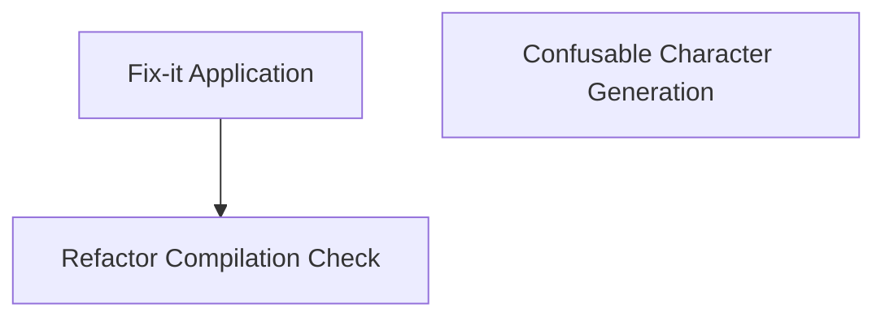

# Swift Code Utilities Module Documentation

## Introduction and Purpose

The `swift_code_utilities` module provides a collection of utility scripts and tools designed to assist in the development, maintenance, and refactoring of Swift codebases. Its core functionalities include applying automated fix-it edits, generating data for handling confusable Unicode characters, and verifying that refactored code still compiles correctly.

## Architecture Overview

The `swift_code_utilities` module is composed of several independent utilities, each addressing a specific aspect of Swift code management. These utilities interact with Swift source files, build artifacts, and compiler tools to perform their operations. The overall architecture is designed for modularity, allowing each tool to be used independently or integrated into larger workflows.

<!-- DIAGRAM_JSON
{
    "direction": "TD",
    "nodes": [
        {"id": "fixit_application", "label": "Fix-it Application", "type": "module", "link": "fixit_application.md"},
        {"id": "confusable_generation", "label": "Confusable Character Generation", "type": "module", "link": "confusable_generation.md"},
        {"id": "refactor_compilation_check", "label": "Refactor Compilation Check", "type": "module", "link": "refactor_compilation_check.md"}
    ],
    "edges": [
        {"source": "fixit_application", "target": "refactor_compilation_check"}
    ],
    "groups": []
}
-->

## High-level Functionality

This module provides the following key functionalities, each detailed in its respective sub-module documentation:

*   **[Fix-it Application](fixit_application.md)**: This utility processes `.remap` files generated by the Swift compiler to automatically apply suggested code edits to source files, streamlining the process of fixing minor compilation issues or warnings.

*   **[Confusable Character Generation](confusable_generation.md)**: This tool generates a definition file (`Confusables.def`) for the Swift parser, which helps identify and handle Unicode characters that can be visually confused with other common programming symbols, enhancing compiler diagnostics and security.

*   **[Refactor Compilation Check](refactor_compilation_check.md)**: Designed to ensure code integrity during refactoring, this utility applies a refactoring edit to a temporary file and then invokes the Swift frontend to type-check the modified code, verifying that the changes do not introduce compilation errors.