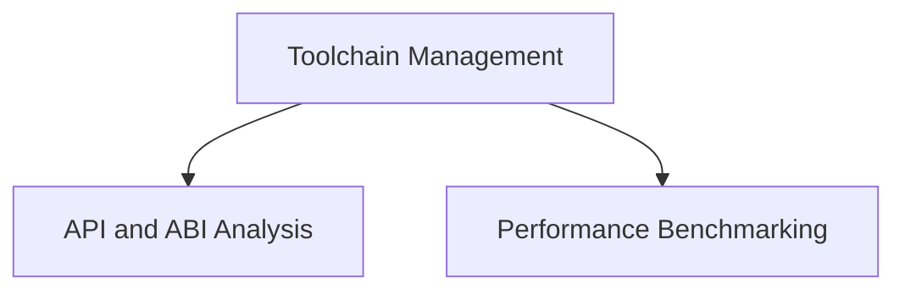

# Swift Toolchain Utilities Module

## Introduction
The `swift_toolchain_utilities` module provides a collection of essential tools for managing, analyzing, and benchmarking Swift toolchains. It offers functionality ranging from downloading unpublished toolchains and post-processing binaries for Darwin platforms to performing in-depth API and ABI analysis, and executing performance benchmarks.

## Architecture Overview
The module is logically divided into several sub-modules, each encapsulating a distinct set of functionalities. These sub-modules work cohesively to provide comprehensive support for Swift toolchain development and maintenance.

<!-- DIAGRAM_JSON
{
    "direction": "TD",
    "nodes": [
        {"id": "toolchain_management", "label": "Toolchain Management", "type": "module", "link": "toolchain_management.md"},
        {"id": "api_and_abi_analysis", "label": "API and ABI Analysis", "type": "module", "link": "api_and_abi_analysis.md"},
        {"id": "performance_benchmarking", "label": "Performance Benchmarking", "type": "module", "link": "performance_benchmarking.md"}
    ],
    "edges": [
        {"source": "toolchain_management", "target": "api_and_abi_analysis"},
        {"source": "toolchain_management", "target": "performance_benchmarking"}
    ],
    "groups": []
}
-->

## High-Level Functionality

### [Toolchain Management](toolchain_management.md)
This sub-module is responsible for handling various aspects of Swift toolchain lifecycle, including downloading unpublished versions and preparing binaries for specific platforms.

### [API and ABI Analysis](api_and_abi_analysis.md)
This sub-module provides tools to inspect and analyze the Application Programming Interface (API) and Application Binary Interface (ABI) of Swift modules, crucial for compatibility checks and understanding module structure.

### [Performance Benchmarking](performance_benchmarking.md)
This sub-module focuses on utilities for running and reporting performance benchmarks, enabling developers to assess and optimize the speed and efficiency of Swift code and toolchain components.
