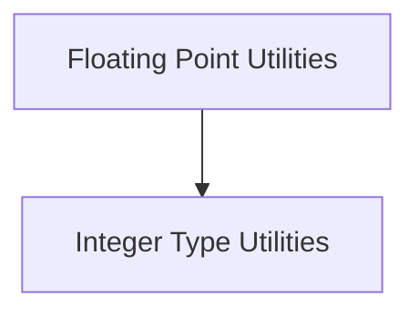

# Swift Type Utilities Documentation

## Introduction
The `swift_type_utilities` module provides a collection of utility functions for querying and manipulating Swift's fundamental numeric types, specifically focusing on floating-point and integer types. These utilities are essential for tasks requiring detailed information about type properties, such as conversion bounds, type enumeration, and identification of signed numeric types.

## Architecture Overview
This module is logically divided into two primary sub-modules: `Floating Point Utilities` and `Integer Type Utilities`. These sub-modules encapsulate functionalities related to their respective numeric type categories, ensuring a clear separation of concerns and maintainability.

<!-- DIAGRAM_JSON
{
    "direction": "TD",
    "nodes": [
        {"id": "floating_point_utilities", "label": "Floating Point Utilities", "type": "module", "link": "floating_point_utilities.md"},
        {"id": "integer_type_utilities", "label": "Integer Type Utilities", "type": "module", "link": "integer_type_utilities.md"}
    ],
    "edges": [
        {"source": "floating_point_utilities", "target": "integer_type_utilities", "label": "Relates to"}
    ],
    "groups": []
}
-->

## Sub-modules

### [Floating Point Utilities](floating_point_utilities.md)
This sub-module focuses on Swift's floating-point types, providing functions to determine conversion bounds from floating-point to integer types and to enumerate all available floating-point types.

### [Integer Type Utilities](integer_type_utilities.md)
This sub-module handles Swift's integer types, offering functionalities to retrieve the names of all numeric types (including integers and real numbers) and to generate a list of all signed integer types based on a given word bitwidth.