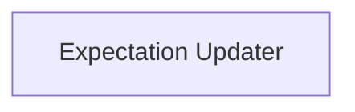

# `test_expectation_handler` Module Documentation

## Introduction
The `test_expectation_handler` module is a crucial component within the `verify_test_updater` system, responsible for managing and updating expected outcomes of Swift compiler tests. It provides both standalone command-line utilities and `lit` plugin integration to ensure that test expectations remain consistent with compiler behavior.

## Architecture Overview
The module is composed of a core `expectation_updater` sub-module that encapsulates the logic for processing test output and applying necessary updates to expectation files. It integrates seamlessly with the `lit` testing framework for automated expectation management during test runs and offers a command-line interface for manual updates.

## Sub-modules
- [Expectation Updater](expectation_updater.md): Handles the logic for updating and verifying test expectations.

<!-- DIAGRAM_JSON
{
    "direction": "TD",
    "nodes": [
        {"id": "expectation_updater", "label": "Expectation Updater", "type": "module", "link": "expectation_updater.md"}
    ],
    "edges": [],
    "groups": []
}
-->

