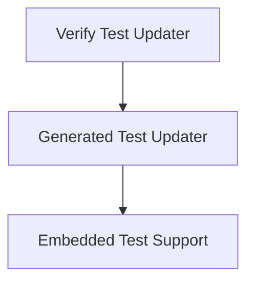

# test_generation_and_update Module Documentation

## Introduction and Purpose

The `test_generation_and_update` module provides a suite of utilities for managing, updating, and verifying various types of tests within the system. It encompasses tools for supporting embedded test environments, automatically updating generated test files, and verifying test expectations. This module streamlines the testing workflow by automating the maintenance of test cases and their expected outputs.

## Architecture Overview

The `test_generation_and_update` module is composed of three primary sub-modules, each addressing a specific aspect of test management:

*   **Embedded Test Support**: Handles the setup and execution of tests for embedded targets.
*   **Generated Test Updater**: Manages the process of updating automatically generated test files.
*   **Verify Test Updater**: Focuses on updating and validating test expectations, particularly for verification tests.

These sub-modules interact to provide a comprehensive framework for test generation, execution, and maintenance.

<!-- DIAGRAM_JSON
{
    "direction": "TD",
    "nodes": [
        {"id": "embedded_test_support", "label": "Embedded Test Support", "type": "module", "link": "embedded_test_support.md"},
        {"id": "generated_test_updater", "label": "Generated Test Updater", "type": "module", "link": "generated_test_updater.md"},
        {"id": "verify_test_updater", "label": "Verify Test Updater", "type": "module", "link": "verify_test_updater.md"}
    ],
    "edges": [
        {"source": "generated_test_updater", "target": "embedded_test_support"},
        {"source": "verify_test_updater", "target": "generated_test_updater"}
    ],
    "groups": []
}
-->

## Sub-modules

### [Embedded Test Support](embedded_test_support.md)
This sub-module provides utilities for configuring and executing embedded tests across various device architectures like ARM QEMU and AVR QEMU, handling compilation and execution flags. It simplifies the process of testing code on specific hardware targets.

### [Generated Test Updater](generated_test_updater.md)
This sub-module manages the update process for automatically generated test files, applying substitutions and ensuring test integrity. It includes functionalities to update test files directly and via Lit test plugin integration.

### [Verify Test Updater](verify_test_updater.md)
This sub-module facilitates the update of verification test expectations based on test output, specifically for Swift frontend tests with '-verify' flags. It processes test stderr output to determine and apply necessary updates to verification files.
