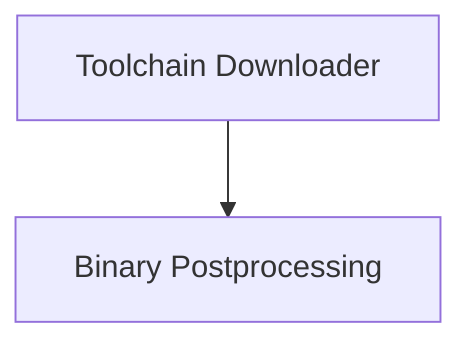

# Toolchain Management Module

## Introduction
The `toolchain_management` module provides essential utilities for managing Swift toolchains, particularly focusing on downloading unpublished versions and post-processing binaries for Darwin platforms. It streamlines the development workflow by ensuring developers have access to the necessary toolchain components and that these components are correctly configured for execution.

## Architecture Overview
The `toolchain_management` module is composed of two primary sub-modules: `toolchain_download` for acquiring toolchains and `binary_postprocessing` for preparing binaries.

<!-- DIAGRAM_JSON
{
    "direction": "TD",
    "nodes": [
        {"id": "toolchain_download", "label": "Toolchain Downloader", "type": "module", "link": "toolchain_download.md"},
        {"id": "binary_postprocessing", "label": "Binary Postprocessing", "type": "module", "link": "binary_postprocessing.md"}
    ],
    "edges": [
        {"source": "toolchain_download", "target": "binary_postprocessing"}
    ],
    "groups": []
}
-->

## Sub-module Functionality

*   **[Toolchain Downloader](toolchain_download.md)**: This sub-module is responsible for fetching and extracting unpublished Swift toolchains from designated build URLs. It ensures that developers can easily access the latest development toolchains, making the process of testing new Swift versions more efficient.

*   **[Binary Postprocessing](binary_postprocessing.md)**: This sub-module contains utilities for preparing Swift binaries for execution on Darwin platforms. This includes codesigning the binaries to meet macOS security requirements and modifying their `@rpath` to ensure correct library linking, which is crucial for the proper functioning of Swift tools and applications.