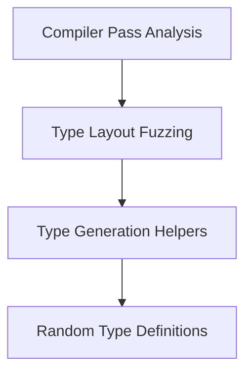

# Type Generation Helpers Module

## Introduction

The `type_generation_helpers` module provides essential utility functions for defining various random type structures, specifically random related types and base classes. These helpers are primarily used within the larger `type_layout_fuzzing` system to facilitate the generation of diverse type layouts for testing and analysis.

## Architecture Overview

This module acts as a core component within the `type_layout_fuzzing` system, which itself is a part of the `compiler_pass_analysis` suite. It encapsulates the logic for dynamically creating type definitions, enabling the fuzzer to explore a wide range of type interactions and layouts. The `random_type_definitions` sub-module houses the specific functions responsible for generating these types.

<!-- DIAGRAM_JSON
{
    "direction": "TD",
    "nodes": [
        {"id": "compiler_pass_analysis", "label": "Compiler Pass Analysis", "type": "external", "link": "compiler_pass_analysis.md"},
        {"id": "type_layout_fuzzing", "label": "Type Layout Fuzzing", "type": "module", "link": "type_layout_fuzzing.md"},
        {"id": "type_generation_helpers", "label": "Type Generation Helpers", "type": "module", "link": "type_generation_helpers.md"},
        {"id": "random_type_definitions", "label": "Random Type Definitions", "type": "module", "link": "random_type_definitions.md"}
    ],
    "edges": [
        {"source": "compiler_pass_analysis", "target": "type_layout_fuzzing"},
        {"source": "type_layout_fuzzing", "target": "type_generation_helpers"},
        {"source": "type_generation_helpers", "target": "random_type_definitions"}
    ],
    "groups": []
}
-->

## Sub-modules

### [Random Type Definitions](random_type_definitions.md)
Provides helper functions for defining random related types and base classes for fuzzing, centralizing the logic for dynamic type creation within the fuzzer. This module contains the core logic for `defineRandomRelatedType` and `defineRandomBaseClass`.
