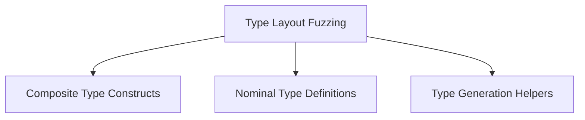

# Type Layout Fuzzing Module

## Introduction

The `type_layout_fuzzing` module is a critical component within the compiler_pass_analysis suite, specifically designed to generate random Swift type layouts for fuzzing purposes. This module helps in discovering layout-related bugs or inconsistencies in the Swift compiler by creating complex and varied type definitions, including structs, enums, classes, tuples, and metatypes. It plays a vital role in ensuring the robustness and correctness of the Swift type system and memory layout.

## Architecture

The `type_layout_fuzzing` module is structured into several sub-modules, each responsible for a specific aspect of type generation and definition. This modular design allows for flexible and extensible fuzzing strategies, enabling the creation of diverse and challenging type layouts.

<!-- DIAGRAM_JSON
{
    "direction": "TD",
    "nodes": [
        {"id": "composite_type_constructs", "label": "Composite Type Constructs", "type": "module", "link": "composite_type_constructs.md"},
        {"id": "nominal_type_definitions", "label": "Nominal Type Definitions", "type": "module", "link": "nominal_type_definitions.md"},
        {"id": "type_generation_helpers", "label": "Type Generation Helpers", "type": "module", "link": "type_generation_helpers.md"}
    ],
    "edges": [
        {"source": "type_layout_fuzzing", "target": "composite_type_constructs"},
        {"source": "type_layout_fuzzing", "target": "nominal_type_definitions"},
        {"source": "type_layout_fuzzing", "target": "type_generation_helpers"}
    ],
    "groups": []
}
-->

## Sub-modules

### [Composite Type Constructs](composite_type_constructs.md)
This sub-module handles the creation of composite types like tuples and metatypes within the fuzzing process.

### [Nominal Type Definitions](nominal_type_definitions.md)
This sub-module is responsible for the generation and definition of nominal types such as structs, enums, and classes for fuzzing.

### [Type Generation Helpers](type_generation_helpers.md)
This sub-module provides utility functions to assist in defining random related types and base classes for the fuzzer.
