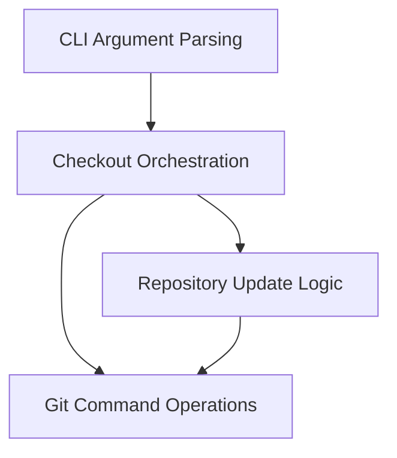

# update_checkout_system Module Documentation

## Introduction

The `update_checkout_system` module is responsible for managing the local Git repositories, primarily for Swift and related open-source projects. It automates the process of cloning, updating, and synchronizing multiple repositories according to specified configurations and schemes. This ensures developers can easily maintain consistent and up-to-date development environments.

## Architecture Overview

The `update_checkout_system` module is structured into several key sub-modules, each handling a specific aspect of the repository management process. The architecture is designed to provide a clear separation of concerns, from parsing command-line arguments to executing Git operations and orchestrating the entire checkout and update flow.

<!-- DIAGRAM_JSON
{
    "direction": "TD",
    "nodes": [
        {"id": "cli_arguments_parser", "label": "CLI Argument Parsing", "type": "module", "link": "cli_arguments_parser.md"},
        {"id": "git_operations", "label": "Git Command Operations", "type": "module", "link": "git_operations.md"},
        {"id": "checkout_orchestration", "label": "Checkout Orchestration", "type": "module", "link": "checkout_orchestration.md"},
        {"id": "repository_management", "label": "Repository Update Logic", "type": "module", "link": "repository_management.md"}
    ],
    "edges": [
        {"source": "cli_arguments_parser", "target": "checkout_orchestration"},
        {"source": "checkout_orchestration", "target": "git_operations"},
        {"source": "checkout_orchestration", "target": "repository_management"},
        {"source": "repository_management", "target": "git_operations"}
    ],
    "groups": []
}
-->

## Sub-modules

This module is composed of the following sub-modules:

### [CLI Argument Parsing](cli_arguments_parser.md)
Handles the parsing of command-line arguments, defining all available options for the update-checkout script.

### [Git Command Operations](git_operations.md)
Provides a utility class for executing Git commands, handling subprocess calls, output, and error management.

### [Checkout Orchestration](checkout_orchestration.md)
Manages the overall flow of the repository update process, including configuration loading, handling GitHub PRs, and coordinating cloning and updating.

### [Repository Update Logic](repository_management.md)
Encapsulates the detailed logic for fetching, cleaning, stashing, checking out, rebasing, and reporting hashes for individual Git repositories.
