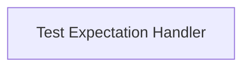

# Verify Test Updater Module Documentation

## Introduction
The `verify_test_updater` module is a crucial component within the larger test generation and update system. Its primary purpose is to automate the process of updating and managing verification tests, ensuring that test expectations are accurately maintained. This module integrates seamlessly with the Lit testing framework, allowing for efficient test result verification and expectation updates.

## Architecture Overview
The `verify_test_updater` module is structured around a core component responsible for handling test expectations. This component can be invoked either as a standalone script or through a specialized Lit plugin, providing flexibility in how test updates are managed within the testing workflow.

<!-- DIAGRAM_JSON
{
    "direction": "TD",
    "nodes": [
        {"id": "test_expectation_handler", "label": "Test Expectation Handler", "type": "module", "link": "test_expectation_handler.md"}
    ],
    "edges": [],
    "groups": []
}
-->

## Sub-modules and Core Functionality

### [Test Expectation Handler](test_expectation_handler.md)
This sub-module contains the core logic for checking, comparing, and updating test expectations. It provides utilities that can be used directly for script-based updates or integrated into the Lit test runner via its plugin for automated in-test updates. It processes test output (e.g., `stderr`) and modifies source files to reflect the new expected outputs.