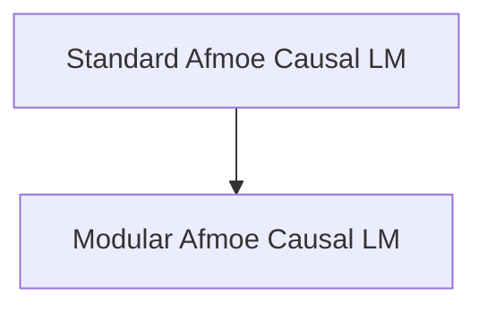

# Afmoe Causal LM Implementations

This module provides various implementations of the AfmoeForCausalLM model, designed for causal language modeling tasks. It includes both a standard implementation and a modular version that extends existing Llama models, offering flexibility and specialized functionalities for handling Mixture-of-Experts (MoE) architectures.

## Architecture Overview

The `afmoe_causal_lm_implementations` module is structured into two main sub-modules, each providing a distinct approach to implementing the Afmoe causal language model. The overall architecture is designed to allow for both a standalone Afmoe model and an integration with existing Llama-based architectures.

<!-- DIAGRAM_JSON
{
    "direction": "TD",
    "nodes": [
        {"id": "modeling_afmoe_causal_lm", "label": "Standard Afmoe Causal LM", "type": "module", "link": "modeling_afmoe_causal_lm.md"},
        {"id": "modular_afmoe_causal_lm", "label": "Modular Afmoe Causal LM", "type": "module", "link": "modular_afmoe_causal_lm.md"}
    ],
    "edges": [
        {"source": "modeling_afmoe_causal_lm", "target": "modular_afmoe_causal_lm", "label": "can extend"}
    ],
    "groups": []
}
-->

## Sub-modules

*   **[Standard Afmoe Causal LM](modeling_afmoe_causal_lm.md)**: This sub-module contains the foundational implementation of the `AfmoeForCausalLM` model. It defines the core architecture and forward pass logic for handling causal language modeling with Afmoe.

*   **[Modular Afmoe Causal LM](modular_afmoe_causal_lm.md)**: This sub-module provides a modular extension of the `AfmoeForCausalLM` model, building upon the `LlamaForCausalLM` architecture. It integrates Afmoe's Mixture-of-Experts (MoE) capabilities within a Llama-compatible framework, offering enhanced flexibility and potential for hybrid models.