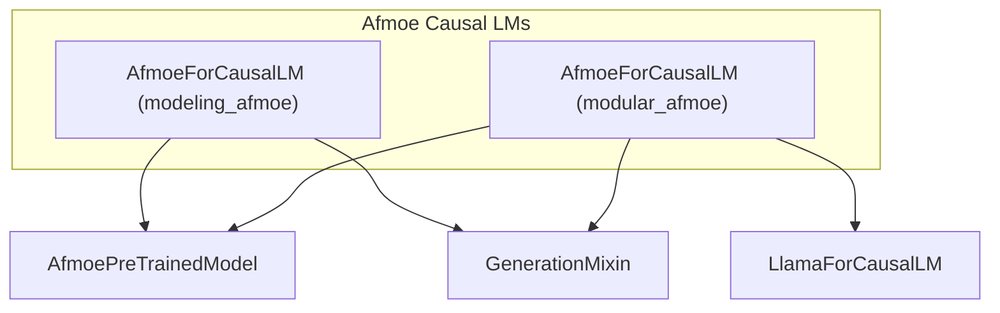

# afmoe_models
This module provides two implementations of the `AfmoeForCausalLM` for causal language modeling. It includes a base version and a modular version that extends `LlamaForCausalLM`.

<!-- DIAGRAM_JSON
{
    "nodes": [
        {
            "id": "A",
            "label": "AfmoeForCausalLM (modeling_afmoe)"
        },
        {
            "id": "B",
            "label": "AfmoeForCausalLM (modular_afmoe)"
        },
        {
            "id": "C",
            "label": "AfmoePreTrainedModel"
        },
        {
            "id": "D",
            "label": "GenerationMixin"
        },
        {
            "id": "E",
            "label": "LlamaForCausalLM"
        }
    ],
    "edges": [
        {
            "source": "A",
            "target": "C",
            "label": "inherits"
        },
        {
            "source": "A",
            "target": "D",
            "label": "inherits"
        },
        {
            "source": "B",
            "target": "E",
            "label": "inherits"
        },
        {
            "source": "B",
            "target": "C",
            "label": "inherits"
        },
        {
            "source": "B",
            "target": "D",
            "label": "inherits"
        }
    ],
    "groups": [
        {
            "id": "afmoe_causal_lms",
            "label": "Afmoe Causal LMs",
            "nodes": [
                "A",
                "B"
            ]
        }
    ]
}
-->
