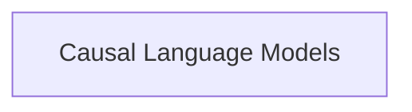

# afmoe_models Module Documentation

## Introduction
The `afmoe_models` module provides the core components for implementing AFMOE (Adaptive Fine-grained Mixture of Experts) models within the transformers library. This module focuses on the causal language modeling capabilities of AFMOE, offering both a standard and a modular approach to model definition.

## Architecture Overview
The `afmoe_models` module is structured around its causal language modeling capabilities. The main components are grouped into a dedicated sub-module for easy access and understanding.

<!-- DIAGRAM_JSON
{
    "direction": "TD",
    "nodes": [
        {"id": "causal_lm_models", "label": "Causal Language Models", "type": "module", "link": "causal_lm_models.md"}
    ],
    "edges": [],
    "groups": []
}
-->

## High-Level Functionality
*   **Causal Language Models** ([`causal_lm_models.md`](causal_lm_models.md)): This sub-module contains the implementations for AFMOE causal language models. It includes classes like `AfmoeForCausalLM`, which are designed for tasks such as text generation.