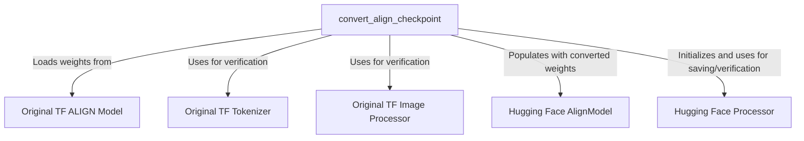

# align_models

This module provides utilities for converting pre-trained ALIGN (A Language and Image Grand Unification) model checkpoints from their original TensorFlow format to the Hugging Face PyTorch format. It ensures compatibility and enables the use of ALIGN models within the Hugging Face Transformers ecosystem.

## Purpose and Core Functionality

The primary purpose of the `align_models` module is to facilitate the migration of ALIGN model weights from TensorFlow to PyTorch. This conversion is crucial for developers who wish to leverage pre-trained ALIGN models in PyTorch-based environments, benefiting from the robust features and functionalities offered by the Hugging Face Transformers library, such as easy loading, fine-tuning, and deployment. The conversion process includes a rigorous verification step to ensure that the converted PyTorch model produces outputs consistent with the original TensorFlow model.

## Architecture and Component Relationships

The `align_models` module is centered around the `convert_align_checkpoint` function, which orchestrates the entire conversion process. It interacts with both the original TensorFlow ALIGN model components and the target Hugging Face PyTorch ALIGN model and processor.

<!-- DIAGRAM_JSON
{
    "direction": "TD",
    "nodes": [
        {"id": "convert_align_checkpoint", "label": "convert_align_checkpoint", "type": "component", "link": null},
        {"id": "original_tf_align_model", "label": "Original TF ALIGN Model", "type": "external", "link": null},
        {"id": "original_tf_tokenizer", "label": "Original TF Tokenizer", "type": "external", "link": null},
        {"id": "original_tf_image_processor", "label": "Original TF Image Processor", "type": "external", "link": null},
        {"id": "hf_align_model", "label": "Hugging Face AlignModel", "type": "external", "link": null},
        {"id": "hf_processor", "label": "Hugging Face Processor", "type": "external", "link": null}
    ],
    "edges": [
        {"source": "convert_align_checkpoint", "target": "original_tf_align_model", "label": "Loads weights from"},
        {"source": "convert_align_checkpoint", "target": "original_tf_tokenizer", "label": "Uses for verification"},
        {"source": "convert_align_checkpoint", "target": "original_tf_image_processor", "label": "Uses for verification"},
        {"source": "convert_align_checkpoint", "target": "hf_align_model", "label": "Populates with converted weights"},
        {"source": "convert_align_checkpoint", "target": "hf_processor", "label": "Initializes and uses for saving/verification"}
    ],
    "groups": []
}
-->

## How the Module Fits into the Overall System

The `align_models` module acts as a bridge between the original TensorFlow implementation of ALIGN and the Hugging Face Transformers library. It is part of a broader set of conversion utilities within the `transformers` library, which aims to support a wide array of models across different frameworks. By converting ALIGN checkpoints, this module enables:

*   **Interoperability**: Users can seamlessly load and use ALIGN models that were originally trained in TensorFlow within a PyTorch environment.
*   **Ecosystem Integration**: The converted models become fully compatible with Hugging Face's tools for model loading, inference, fine-tuning, and sharing on the Hugging Face Hub.
*   **Reproducibility and Accessibility**: It makes pre-trained ALIGN models more accessible to a wider research and development community, promoting reproducibility of results.

## Key Components

### `convert_align_checkpoint`

*   **Location**: `src.transformers.models.align.convert_align_tf_to_hf.convert_align_checkpoint`
*   **Description**: This is the core function of the module, responsible for the entire conversion process. It performs the following steps:
    1.  Loads the original TensorFlow ALIGN model and its weights.
    2.  Initializes a Hugging Face `AlignModel` (PyTorch) and populates its state dictionary with the converted weights from the TensorFlow model.
    3.  Initializes a Hugging Face `processor` for image and text pre-processing.
    4.  Performs inference with both the original TensorFlow model and the newly converted Hugging Face PyTorch model using identical inputs.
    5.  Compares the outputs of both models (image and text features) using `np.allclose` to ensure numerical equivalence, thereby validating the conversion.
    6.  Optionally saves the converted Hugging Face model and processor to a specified directory.
    7.  Optionally pushes the converted model and processor to the Hugging Face Hub.
*   **Parameters**:
    *   `checkpoint_path`: Path to the original TensorFlow ALIGN model checkpoint.
    *   `pytorch_dump_folder_path`: Directory where the converted PyTorch model and processor will be saved.
    *   `save_model`: Boolean flag to indicate whether to save the model locally.
    *   `push_to_hub`: Boolean flag to indicate whether to push the model to the Hugging Face Hub.
*   **Dependencies**: Internally relies on original ALIGN `Tokenizer` and `EfficientNetImageProcessor` for verification, and on Hugging Face's `AlignModel` and `processor` for the target model and pre-processing.