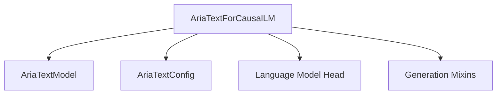

# Aria Models Documentation

## Introduction

The `aria_models` module provides the core implementation for the AriaText causal language model within the Hugging Face Transformers library. This module focuses on enabling text generation capabilities using the AriaText architecture.

## Architecture and Core Components

The primary component of this module is `AriaTextForCausalLM`, which is responsible for the overall causal language modeling functionality, including text generation and loss computation. It integrates with a base `AriaTextModel` for the transformer layers and leverages the `GenerationMixin` for common generation utilities.

### AriaTextForCausalLM

- **Purpose**: Implements the causal language modeling head on top of the `AriaTextModel`. It handles the forward pass for text generation, computes logits, and optionally calculates the language modeling loss.
- **Location**: `src/transformers/models/aria/modeling_aria.py`
- **Key Functionality**:
    - Initializes with an `AriaTextConfig` to define the model's architecture.
    - Contains a `self.model` attribute, which is an instance of `AriaTextModel`, representing the main body of the transformer network.
    - Includes an `lm_head` (a linear layer) that maps the hidden states from the `AriaTextModel` to the vocabulary space to produce logits.
    - The `forward` method orchestrates the computation:
        1. Passes input through `self.model` to obtain hidden states.
        2. Applies `self.lm_head` to these hidden states to get raw logits.
        3. If labels are provided, it computes the causal language modeling loss.
        4. Returns `CausalLMOutputWithPast`, containing the loss (if computed), logits, and other model outputs.

### How Aria Models Fit into the Overall System

The `aria_models` module is a specific model implementation within the larger Transformers ecosystem. It relies on foundational utilities from other modules, such as `generation_mixins` for common text generation strategies. Developers can load and use `AriaTextForCausalLM` via the standard Hugging Face `AutoModel` and `AutoTokenizer` interfaces for various natural language generation tasks.

<!-- DIAGRAM_JSON
{
    "direction": "TD",
    "nodes": [
        {"id": "aria_text_for_causal_lm", "label": "AriaTextForCausalLM", "type": "component", "link": null},
        {"id": "aria_text_model", "label": "AriaTextModel", "type": "component", "link": null},
        {"id": "aria_text_config", "label": "AriaTextConfig", "type": "component", "link": null},
        {"id": "lm_head", "label": "Language Model Head", "type": "component", "link": null},
        {"id": "generation_mixins", "label": "Generation Mixins", "type": "external", "link": "generation_mixins.md"}
    ],
    "edges": [
        {"source": "aria_text_for_causal_lm", "target": "aria_text_model"},
        {"source": "aria_text_for_causal_lm", "target": "aria_text_config"},
        {"source": "aria_text_for_causal_lm", "target": "lm_head"},
        {"source": "aria_text_for_causal_lm", "target": "generation_mixins"}
    ],
    "groups": []
}
-->
