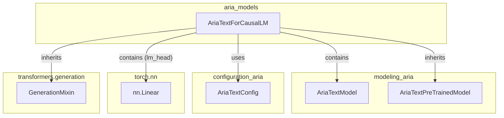

# aria_models
This module provides the AriaTextForCausalLM model, an AriaText language model with a causal language modeling head for text generation. It extends AriaTextPreTrainedModel and incorporates GenerationMixin.

<!-- DIAGRAM_JSON
{
  "nodes": [
    {"id": "AriaTextForCausalLM", "label": "AriaTextForCausalLM", "url": "src.transformers.models.aria.modeling_aria.AriaTextForCausalLM"},
    {"id": "AriaTextModel", "label": "AriaTextModel", "url": "src.transformers.models.aria.modeling_aria.AriaTextModel"},
    {"id": "AriaTextPreTrainedModel", "label": "AriaTextPreTrainedModel", "url": "src.transformers.models.aria.modeling_aria.AriaTextPreTrainedModel"},
    {"id": "GenerationMixin", "label": "GenerationMixin", "url": "src.transformers.generation.utils.GenerationMixin"},
    {"id": "AriaTextConfig", "label": "AriaTextConfig", "url": "src.transformers.models.aria.configuration_aria.AriaTextConfig"},
    {"id": "nn_Linear", "label": "nn.Linear", "url": "torch.nn.Linear"}
  ],
  "edges": [
    {"source": "AriaTextForCausalLM", "target": "AriaTextPreTrainedModel", "label": "inherits"},
    {"source": "AriaTextForCausalLM", "target": "GenerationMixin", "label": "inherits"},
    {"source": "AriaTextForCausalLM", "target": "AriaTextModel", "label": "contains"},
    {"source": "AriaTextForCausalLM", "target": "nn_Linear", "label": "contains (lm_head)"},
    {"source": "AriaTextForCausalLM", "target": "AriaTextConfig", "label": "uses"}
  ],
  "groups": [
    {"id": "aria_models", "label": "aria_models", "nodes": ["AriaTextForCausalLM"]},
    {"id": "modeling_aria", "label": "modeling_aria", "nodes": ["AriaTextModel", "AriaTextPreTrainedModel"]},
    {"id": "configuration_aria", "label": "configuration_aria", "nodes": ["AriaTextConfig"]},
    {"id": "torch_nn", "label": "torch.nn", "nodes": ["nn_Linear"]},
    {"id": "transformers_generation", "label": "transformers.generation", "nodes": ["GenerationMixin"]}
  ]
}
-->
