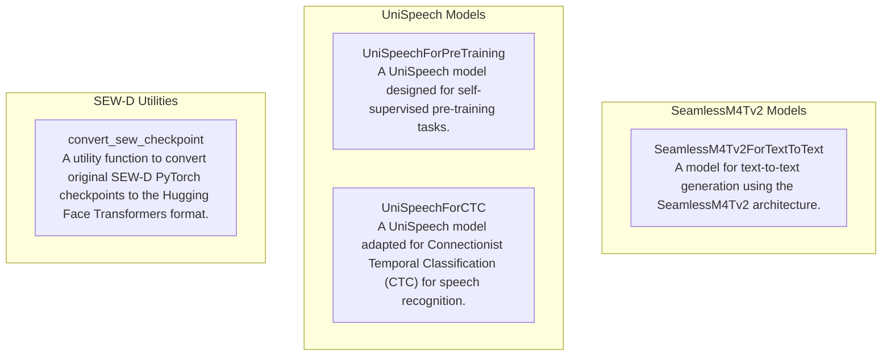

# audio_and_speech_processing
This module encompasses various models and utilities for audio and speech processing, including text-to-text generation, pre-training, CTC-based speech recognition, and checkpoint conversion for specific speech models.

<!-- DIAGRAM_JSON
{
  "nodes": [
    {
      "id": "SeamlessM4Tv2ForTextToText",
      "label": "SeamlessM4Tv2ForTextToText",
      "description": "A model for text-to-text generation using the SeamlessM4Tv2 architecture."
    },
    {
      "id": "convert_sew_checkpoint",
      "label": "convert_sew_checkpoint",
      "description": "A utility function to convert original SEW-D PyTorch checkpoints to the Hugging Face Transformers format."
    },
    {
      "id": "UniSpeechForPreTraining",
      "label": "UniSpeechForPreTraining",
      "description": "A UniSpeech model designed for self-supervised pre-training tasks."
    },
    {
      "id": "UniSpeechForCTC",
      "label": "UniSpeechForCTC",
      "description": "A UniSpeech model adapted for Connectionist Temporal Classification (CTC) for speech recognition."
    }
  ],
  "edges": [],
  "groups": [
    {
      "id": "SeamlessM4Tv2 Models",
      "label": "SeamlessM4Tv2 Models",
      "nodes": ["SeamlessM4Tv2ForTextToText"]
    },
    {
      "id": "UniSpeech Models",
      "label": "UniSpeech Models",
      "nodes": ["UniSpeechForPreTraining", "UniSpeechForCTC"]
    },
    {
      "id": "SEW-D Utilities",
      "label": "SEW-D Utilities",
      "nodes": ["convert_sew_checkpoint"]
    }
  ]
}
-->
