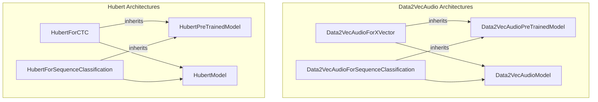

# audio_model_architectures
This module provides various audio model architectures, including Data2VecAudio and Hubert models adapted for tasks like X-vector speaker verification, sequence classification, and Connectionist Temporal Classification (CTC).

<!-- DIAGRAM_JSON
{
  "nodes": [
    {"id": "Data2VecAudioForXVector", "label": "Data2VecAudioForXVector"},
    {"id": "Data2VecAudioForSequenceClassification", "label": "Data2VecAudioForSequenceClassification"},
    {"id": "HubertForCTC", "label": "HubertForCTC"},
    {"id": "HubertForSequenceClassification", "label": "HubertForSequenceClassification"},
    {"id": "Data2VecAudioModel", "label": "Data2VecAudioModel"},
    {"id": "HubertModel", "label": "HubertModel"},
    {"id": "Data2VecAudioPreTrainedModel", "label": "Data2VecAudioPreTrainedModel"},
    {"id": "HubertPreTrainedModel", "label": "HubertPreTrainedModel"}
  ],
  "edges": [
    {"source": "Data2VecAudioForXVector", "target": "Data2VecAudioPreTrainedModel", "label": "inherits", "type": "inheritance"},
    {"source": "Data2VecAudioForSequenceClassification", "target": "Data2VecAudioPreTrainedModel", "label": "inherits", "type": "inheritance"},
    {"source": "HubertForCTC", "target": "HubertPreTrainedModel", "label": "inherits", "type": "inheritance"},
    {"source": "HubertForSequenceClassification", "target": "HubertPreTrainedModel", "label": "inherits", "type": "inheritance"},
    {"source": "Data2VecAudioForXVector", "target": "Data2VecAudioModel", "label": "uses", "type": "composition"},
    {"source": "Data2VecAudioForSequenceClassification", "target": "Data2VecAudioModel", "label": "uses", "type": "composition"},
    {"source": "HubertForCTC", "target": "HubertModel", "label": "uses", "type": "composition"},
    {"source": "HubertForSequenceClassification", "target": "HubertModel", "label": "uses", "type": "composition"}
  ],
  "groups": [
    {
      "id": "Data2VecAudioArchitectures",
      "label": "Data2VecAudio Architectures",
      "nodes": ["Data2VecAudioForXVector", "Data2VecAudioForSequenceClassification", "Data2VecAudioModel", "Data2VecAudioPreTrainedModel"]
    },
    {
      "id": "HubertArchitectures",
      "label": "Hubert Architectures",
      "nodes": ["HubertForCTC", "HubertForSequenceClassification", "HubertModel", "HubertPreTrainedModel"]
    }
  ]
}
-->
