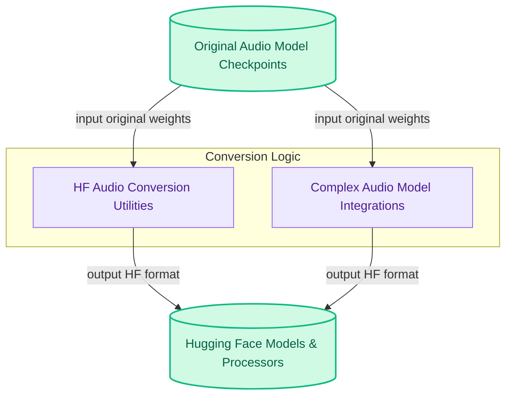

# Audio Model Converters
This module provides functionalities to convert various audio model checkpoints from their original formats into Hugging Face compatible models and processors, enabling seamless integration and usage within the ecosystem.

<!-- DIAGRAM_JSON
{
    "direction": "TD",
    "nodes": [
        {"id": "hf_audio_conversion_utilities", "label": "HF Audio Conversion Utilities", "type": "module", "link": "hf_audio_conversion_utilities.md"},
        {"id": "complex_audio_model_integrations", "label": "Complex Audio Model Integrations", "type": "module", "link": "complex_audio_model_integrations.md"},
        {"id": "original_checkpoints", "label": "Original Audio Model Checkpoints", "type": "external"},
        {"id": "hf_models_and_processors", "label": "Hugging Face Models & Processors", "type": "external"}
    ],
    "edges": [
        {"source": "original_checkpoints", "target": "hf_audio_conversion_utilities", "label": "input original weights"},
        {"source": "original_checkpoints", "target": "complex_audio_model_integrations", "label": "input original weights"},
        {"source": "hf_audio_conversion_utilities", "target": "hf_models_and_processors", "label": "output HF format"},
        {"source": "complex_audio_model_integrations", "target": "hf_models_and_processors", "label": "output HF format"}
    ],
    "groups": [
        {"id": "data_sources", "label": "Data Sources", "role": "data", "nodes": ["original_checkpoints"]},
        {"id": "conversion_logic", "label": "Conversion Logic", "role": "analytical", "nodes": ["hf_audio_conversion_utilities", "complex_audio_model_integrations"]},
        {"id": "output_data", "label": "Output Data", "role": "data", "nodes": ["hf_models_and_processors"]}
    ]
}
-->
