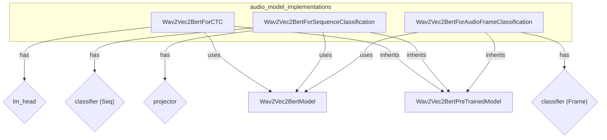

# audio_model_implementations
This module provides three specialized Wav2Vec2-BERT models for different audio tasks: Connectionist Temporal Classification (CTC), sequence classification, and audio frame classification.

<!-- DIAGRAM_JSON
{
  "nodes": [
    {"id": "A", "label": "Wav2Vec2BertForCTC"},
    {"id": "B", "label": "Wav2Vec2BertForSequenceClassification"},
    {"id": "C", "label": "Wav2Vec2BertForAudioFrameClassification"},
    {"id": "D", "label": "Wav2Vec2BertModel"},
    {"id": "E", "label": "Wav2Vec2BertPreTrainedModel"},
    {"id": "F", "label": "lm_head"},
    {"id": "G", "label": "projector"},
    {"id": "H", "label": "classifier (Seq)"},
    {"id": "I", "label": "classifier (Frame)"}
  ],
  "edges": [
    {"source": "A", "target": "E", "label": "inherits"},
    {"source": "B", "target": "E", "label": "inherits"},
    {"source": "C", "target": "E", "label": "inherits"},
    {"source": "A", "target": "D", "label": "uses"},
    {"source": "B", "target": "D", "label": "uses"},
    {"source": "C", "target": "D", "label": "uses"},
    {"source": "A", "target": "F", "label": "has"},
    {"source": "B", "target": "G", "label": "has"},
    {"source": "B", "target": "H", "label": "has"},
    {"source": "C", "target": "I", "label": "has"}
  ],
  "groups": [
    {"id": "audio_model_implementations_group", "label": "audio_model_implementations", "nodes": ["A", "B", "C"]}
  ]
}
-->
