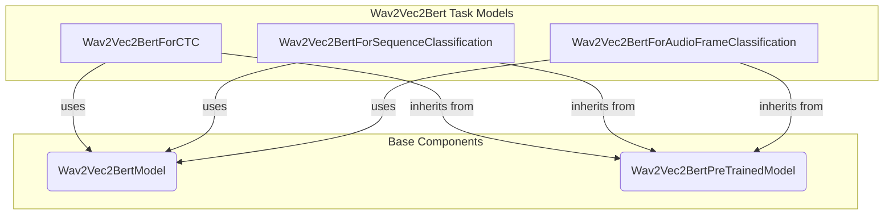

# audio_models_part_10
This module provides specialized Wav2Vec2Bert models for various audio tasks, including Connectionist Temporal Classification (CTC), sequence classification, and audio frame classification.

<!-- DIAGRAM_JSON
{
  "nodes": [
    {"id": "Wav2Vec2BertForCTC", "label": "Wav2Vec2BertForCTC"},
    {"id": "Wav2Vec2BertForSequenceClassification", "label": "Wav2Vec2BertForSequenceClassification"},
    {"id": "Wav2Vec2BertForAudioFrameClassification", "label": "Wav2Vec2BertForAudioFrameClassification"},
    {"id": "Wav2Vec2BertModel", "label": "Wav2Vec2BertModel"},
    {"id": "Wav2Vec2BertPreTrainedModel", "label": "Wav2Vec2BertPreTrainedModel"}
  ],
  "edges": [
    {"source": "Wav2Vec2BertForCTC", "target": "Wav2Vec2BertModel", "label": "uses"},
    {"source": "Wav2Vec2BertForSequenceClassification", "target": "Wav2Vec2BertModel", "label": "uses"},
    {"source": "Wav2Vec2BertForAudioFrameClassification", "target": "Wav2Vec2BertModel", "label": "uses"},
    {"source": "Wav2Vec2BertForCTC", "target": "Wav2Vec2BertPreTrainedModel", "label": "inherits"},
    {"source": "Wav2Vec2BertForSequenceClassification", "target": "Wav2Vec2BertPreTrainedModel", "label": "inherits"},
    {"source": "Wav2Vec2BertForAudioFrameClassification", "target": "Wav2Vec2BertPreTrainedModel", "label": "inherits"}
  ],
  "groups": [
    {"id": "Wav2Vec2Bert Task Models", "members": ["Wav2Vec2BertForCTC", "Wav2Vec2BertForSequenceClassification", "Wav2Vec2BertForAudioFrameClassification"]},
    {"id": "Base Components", "members": ["Wav2Vec2BertModel", "Wav2Vec2BertPreTrainedModel"]}
  ]
}
-->
