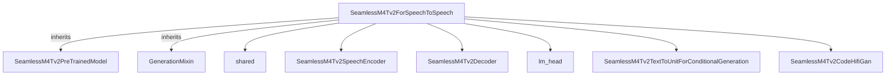

# audio_models_part_4
The `audio_models_part_4` module defines `SeamlessM4Tv2ForSpeechToSpeech`, a comprehensive model for direct speech-to-speech translation. It integrates an encoder, decoder, and vocoder to handle audio input and generate audio output.

<!-- DIAGRAM_JSON
{
  "nodes": [
    {"id": "A", "label": "SeamlessM4Tv2ForSpeechToSpeech"},
    {"id": "B", "label": "SeamlessM4Tv2PreTrainedModel"},
    {"id": "C", "label": "GenerationMixin"},
    {"id": "D", "label": "shared"},
    {"id": "E", "label": "SeamlessM4Tv2SpeechEncoder"},
    {"id": "F", "label": "SeamlessM4Tv2Decoder"},
    {"id": "G", "label": "lm_head"},
    {"id": "H", "label": "SeamlessM4Tv2TextToUnitForConditionalGeneration"},
    {"id": "I", "label": "SeamlessM4Tv2CodeHifiGan"}
  ],
  "edges": [
    {"source": "A", "target": "B", "type": "inheritance"},
    {"source": "A", "target": "C", "type": "inheritance"},
    {"source": "A", "target": "D", "type": "composition"},
    {"source": "A", "target": "E", "type": "composition"},
    {"source": "A", "target": "F", "type": "composition"},
    {"source": "A", "target": "G", "type": "composition"},
    {"source": "A", "target": "H", "type": "composition"},
    {"source": "A", "target": "I", "type": "composition"}
  ],
  "groups": []
}
-->
