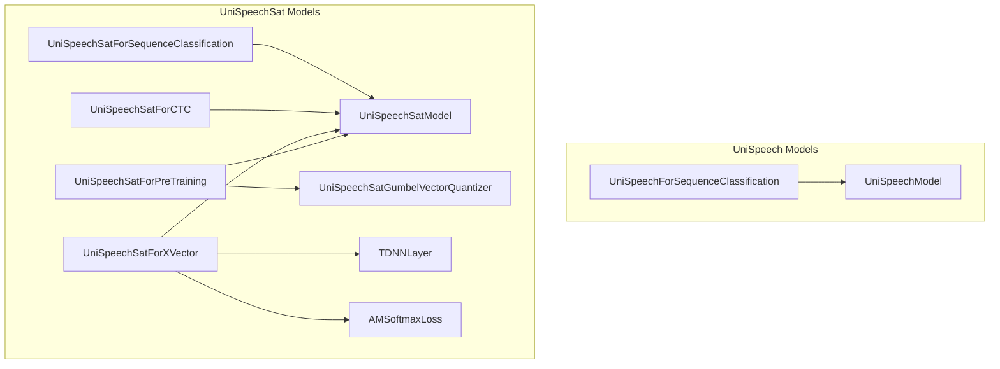

# audio_models_part_8
This module defines various models for audio processing, including sequence classification, pre-training, x-vector extraction, and CTC for both UniSpeech and UniSpeechSat architectures.

<!-- DIAGRAM_JSON
{
  "nodes": [
    {"id": "USSC", "label": "UniSpeechForSequenceClassification"},
    {"id": "USSP", "label": "UniSpeechSatForPreTraining"},
    {"id": "USSX", "label": "UniSpeechSatForXVector"},
    {"id": "USSCtc", "label": "UniSpeechSatForCTC"},
    {"id": "USSSC", "label": "UniSpeechSatForSequenceClassification"},
    {"id": "UM", "label": "UniSpeechModel"},
    {"id": "USM", "label": "UniSpeechSatModel"},
    {"id": "USGVQ", "label": "UniSpeechSatGumbelVectorQuantizer"},
    {"id": "TDNN", "label": "TDNNLayer"},
    {"id": "AMSL", "label": "AMSoftmaxLoss"}
  ],
  "edges": [
    {"source": "USSC", "target": "UM", "label": "uses"},
    {"source": "USSP", "target": "USM", "label": "uses"},
    {"source": "USSP", "target": "USGVQ", "label": "uses"},
    {"source": "USSX", "target": "USM", "label": "uses"},
    {"source": "USSX", "target": "TDNN", "label": "uses"},
    {"source": "USSX", "target": "AMSL", "label": "uses"},
    {"source": "USSCtc", "target": "USM", "label": "uses"},
    {"source": "USSSC", "target": "USM", "label": "uses"}
  ],
  "groups": [
    {"id": "UniSpeech", "label": "UniSpeech Models", "nodes": ["USSC", "UM"]},
    {"id": "UniSpeechSat", "label": "UniSpeechSat Models", "nodes": ["USSP", "USSX", "USSCtc", "USSSC", "USM", "USGVQ", "TDNN", "AMSL"]}
  ]
}
-->
