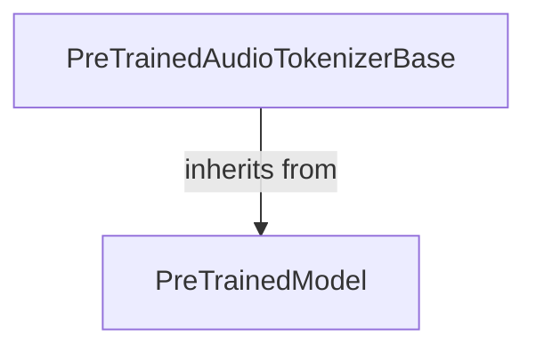

# Audio Tokenization Base Module

The `audio_tokenization_base` module provides the foundational abstract class `PreTrainedAudioTokenizerBase`, which defines the core interface for audio tokenizers within the Hugging Face Transformers library. Its primary purpose is to establish a standardized way for models to encode raw audio into discrete audio codebooks and decode them back into raw audio.

## Architecture and Component Relationships

This module contains a single, crucial abstract class that all audio tokenizers should inherit from, ensuring consistency across various audio processing models.

<!-- DIAGRAM_JSON
{
    "direction": "TD",
    "nodes": [
        {"id": "pre_trained_audio_tokenizer_base", "label": "PreTrainedAudioTokenizerBase", "type": "component", "link": null},
        {"id": "pre_trained_model", "label": "PreTrainedModel", "type": "external", "link": "modeling_utilities.md"}
    ],
    "edges": [
        {"source": "pre_trained_audio_tokenizer_base", "target": "pre_trained_model", "label": "inherits from"}
    ],
    "groups": []
}
-->

### `PreTrainedAudioTokenizerBase`

`PreTrainedAudioTokenizerBase` (`src.transformers.modeling_utils.PreTrainedAudioTokenizerBase`) is an abstract base class that extends `PreTrainedModel`. It mandates the implementation of two key methods:

*   `encode(self, input_values: torch.Tensor, *args, **kwargs)`:
    This abstract method is responsible for taking raw audio input, typically preprocessed by a `FeatureExtractor`, and converting it into discrete audio codebooks. These codebooks can have multiple channels, representing different aspects of the audio signal.

*   `decode(self, audio_codes: torch.Tensor, *args, **kwargs)`:
    This abstract method defines the process of reconstructing raw audio from discrete audio codebooks. While there might be different ways to decode based on the specific representation, all implementations must support this functionality.

### Dependencies

*   **`PreTrainedModel`**: The `PreTrainedAudioTokenizerBase` class inherits from `PreTrainedModel`, which provides common functionalities for all pre-trained models in the Transformers library, such as saving, loading, and handling configurations. For more details, refer to the [modeling_utilities.md](modeling_utilities.md) documentation.

## How it Fits into the Overall System

This module acts as a crucial interface for audio processing pipelines. By providing a common base for all audio tokenizers, it ensures that models relying on audio tokenization (e.g., for speech recognition, text-to-speech, or audio generation) can interact with various tokenizer implementations through a unified API. This standardization simplifies the integration of new audio tokenizer architectures and promotes modularity within the Transformers ecosystem. Future audio models that require encoding and decoding capabilities will build upon this base class, adhering to its defined contract for audio tokenization.