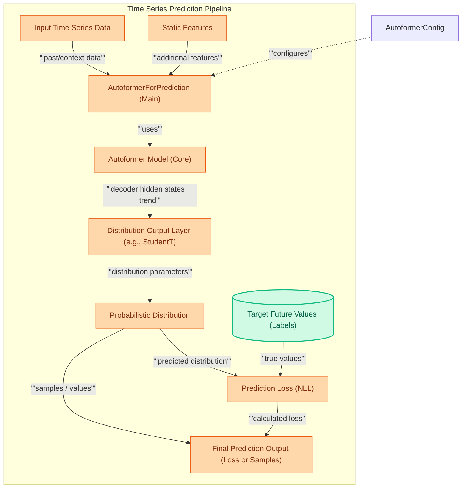

# Autoformer Prediction Module

This module enables time series forecasting through the `AutoformerForPrediction` class, integrating an Autoformer model with adaptable probabilistic distribution heads and loss functions for both training and inference.

<!-- DIAGRAM_JSON
{
    "direction": "TD",
    "nodes": [
        {"id": "autoformer_for_prediction", "label": "AutoformerForPrediction (Main)", "type": "component", "link": null},
        {"id": "input_data", "label": "Input Time Series Data", "type": "component", "link": null},
        {"id": "static_features", "label": "Static Features", "type": "component", "link": null},
        {"id": "autoformer_model", "label": "Autoformer Model (Core)", "type": "component", "link": null},
        {"id": "dist_output", "label": "Distribution Output Layer", "type": "component", "link": null},
        {"id": "prob_dist", "label": "Probabilistic Distribution", "type": "component", "link": null},
        {"id": "future_labels", "label": "Target Future Values (Labels)", "type": "data", "link": null},
        {"id": "prediction_loss", "label": "Prediction Loss (NLL)", "type": "component", "link": null},
        {"id": "prediction_output", "label": "Final Prediction Output", "type": "component", "link": null},
        {"id": "autoformer_config", "label": "AutoformerConfig", "type": "external", "link": "autoformer_config.md"}
    ],
    "edges": [
        {"source": "input_data", "target": "autoformer_for_prediction", "label": "past/context data"},
        {"source": "static_features", "target": "autoformer_for_prediction", "label": "additional features"},
        {"source": "autoformer_config", "target": "autoformer_for_prediction", "label": "configures"},
        {"source": "autoformer_for_prediction", "target": "autoformer_model", "label": "uses"},
        {"source": "autoformer_model", "target": "dist_output", "label": "decoder hidden states + trend"},
        {"source": "dist_output", "target": "prob_dist", "label": "distribution parameters"},
        {"source": "prob_dist", "target": "prediction_output", "label": "samples / values"},
        {"source": "future_labels", "target": "prediction_loss", "label": "true values"},
        {"source": "prob_dist", "target": "prediction_loss", "label": "predicted distribution"},
        {"source": "prediction_loss", "target": "prediction_output", "label": "calculated loss"}
    ],
    "groups": [
        {"id": "prediction_pipeline", "label": "Time Series Prediction Pipeline", "role": "generative", "nodes": ["input_data", "static_features", "autoformer_for_prediction", "autoformer_model", "dist_output", "prob_dist", "prediction_loss", "prediction_output", "future_labels"]}
    ]
}
-->

