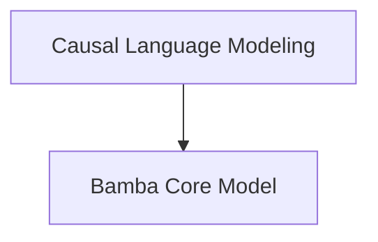

# Bamba Models Documentation

This module contains the Bamba model implementations, focusing on its causal language modeling capabilities and core architectural components.

## Architecture Overview
The `bamba_models` module is structured into two main sub-modules: `causal_lm` and `core_model`. The `causal_lm` sub-module provides the `BambaForCausalLM` class, which extends the base `BambaModel` from the `core_model` sub-module to add causal language modeling specific functionalities like loss computation and text generation. The `core_model` sub-module defines the fundamental `BambaModel` architecture, including token embeddings, decoder layers, and attention mechanisms.

## Sub-modules
- [Causal Language Modeling](causal_lm.md): This sub-module provides the Bamba model specifically configured for causal language modeling tasks, including loss computation and generation utilities.
- [Bamba Core Model](core_model.md): This sub-module defines the foundational architecture and forward pass logic for the Bamba model, handling token embeddings, layers, and attention mechanisms.

<!-- DIAGRAM_JSON
{
    "direction": "TD",
    "nodes": [
        {"id": "causal_lm", "label": "Causal Language Modeling", "type": "module", "link": "causal_lm.md"},
        {"id": "core_model", "label": "Bamba Core Model", "type": "module", "link": "core_model.md"}
    ],
    "edges": [
        {"source": "causal_lm", "target": "core_model"}
    ],
    "groups": []
}
-->
