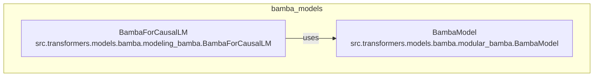

# bamba_models
The `bamba_models` module defines the core components for the Bamba language model architecture, including the causal language model head and the foundational model block.

<!-- DIAGRAM_JSON
{
  "nodes": [
    {
      "id": "BambaForCausalLM",
      "label": "BambaForCausalLM",
      "path": "src.transformers.models.bamba.modeling_bamba.BambaForCausalLM"
    },
    {
      "id": "BambaModel",
      "label": "BambaModel",
      "path": "src.transformers.models.bamba.modular_bamba.BambaModel"
    }
  ],
  "edges": [
    {
      "source": "BambaForCausalLM",
      "target": "BambaModel",
      "label": "uses"
    }
  ],
  "groups": [
    {
      "id": "bamba_models",
      "label": "bamba_models",
      "contains": ["BambaForCausalLM", "BambaModel"]
    }
  ]
}
-->
