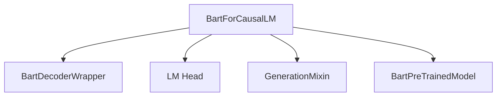

The `bart_modeling_causallm` module focuses on implementing the BART model specifically for causal language modeling tasks. This module provides the `BartForCausalLM` class, which extends the base BART architecture with a language modeling head, allowing it to generate text in an autoregressive fashion.

### Architecture and Component Relationships

The `BartForCausalLM` class is designed as a decoder-only model, built upon the foundational `BartPreTrainedModel` and incorporating capabilities from the `GenerationMixin` to facilitate text generation. It encapsulates a `BartDecoderWrapper` for the core decoder functionality and an `lm_head` (a linear layer) to project the decoder's hidden states to the vocabulary space for predicting the next token.

The relationships between the main components are illustrated in the following diagram:

<!-- DIAGRAM_JSON
{
    "direction": "TD",
    "nodes": [
        {"id": "bart_for_causal_lm", "label": "BartForCausalLM", "type": "component", "link": null},
        {"id": "bart_decoder_wrapper", "label": "BartDecoderWrapper", "type": "component", "link": null},
        {"id": "lm_head", "label": "LM Head", "type": "component", "link": null},
        {"id": "generation_mixin", "label": "GenerationMixin", "type": "external", "link": "generation_mixins.md"},
        {"id": "bart_pretrained_model", "label": "BartPreTrainedModel", "type": "external", "link": "bart_models.md"}
    ],
    "edges": [
        {"source": "bart_for_causal_lm", "target": "bart_decoder_wrapper"},
        {"source": "bart_for_causal_lm", "target": "lm_head"},
        {"source": "bart_for_causal_lm", "target": "generation_mixin"},
        {"source": "bart_for_causal_lm", "target": "bart_pretrained_model"}
    ],
    "groups": []
}
-->

### Core Functionality

The `BartForCausalLM` class provides the following key functionalities:

*   **Initialization (`__init__`)**: Configures the BART model as a decoder-only model for causal language modeling. It initializes the `BartDecoderWrapper` and the `lm_head`, ensuring that the language modeling head's weights are tied to the decoder's input embeddings for efficient parameter usage.
*   **Input/Output Embeddings (`get_input_embeddings`, `set_input_embeddings`)**: Provides standard methods to access and modify the input embeddings of the decoder, which are crucial for integrating with various tokenization schemes.
*   **Forward Pass (`forward`)**: Processes input sequences through the BART decoder to generate logits for the next token prediction. It supports various inputs such as `input_ids`, `attention_mask`, `encoder_hidden_states` (though primarily a decoder, it can still leverage encoder outputs in an encoder-decoder context for generation), `past_key_values` for efficient decoding, and `labels` for computing the causal language modeling loss. The method can optionally compute and return the loss based on provided labels.

### How it Fits into the Overall System

The `bart_modeling_causallm` module is a specialized component within the broader [bart_models](bart_models.md) ecosystem, specifically residing under the [modeling](bart_models.md#modeling) sub-module. It leverages the foundational BART architecture components defined in `bart_models` and integrates with the [generation_mixins](generation_mixins.md) module to inherit common text generation utilities. This module is essential for applications requiring autoregressive text generation using the BART architecture.