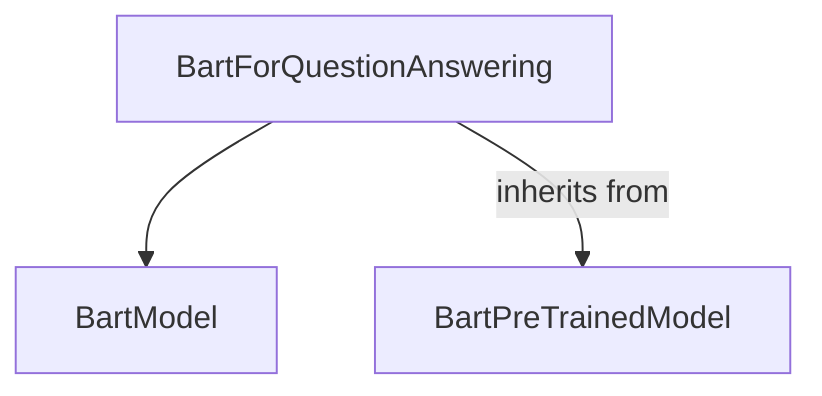

# bart_modeling_qa Module Documentation

## Introduction

The `bart_modeling_qa` module provides the `BartForQuestionAnswering` class, a specific implementation of the BART (Bidirectional Encoder Representations from Transformers) model fine-tuned for question answering tasks. This module enables the model to identify start and end positions of answers within a given text, making it suitable for extractive question answering.

## Architecture and Component Relationships

The `bart_modeling_qa` module is a specialized component within the broader [bart_models](bart_models.md) family, specifically nested under the [modeling](bart_modeling.md) sub-module. It leverages the core `BartModel` for its encoder-decoder architecture and extends it with a question answering head.

<!-- DIAGRAM_JSON
{
    "direction": "TD",
    "nodes": [
        {"id": "bart_qa_model", "label": "BartForQuestionAnswering", "type": "component", "link": null},
        {"id": "bart_model_base", "label": "BartModel", "type": "external", "link": "bart_modeling.md"},
        {"id": "bart_pretrained_base", "label": "BartPreTrainedModel", "type": "external", "link": "modeling_utilities.md"}
    ],
    "edges": [
        {"source": "bart_qa_model", "target": "bart_model_base"},
        {"source": "bart_qa_model", "target": "bart_pretrained_base", "label": "inherits from"}
    ],
    "groups": []
}
-->

### Core Components

#### `BartForQuestionAnswering`

The `BartForQuestionAnswering` class is the primary component of this module. It inherits from `BartPreTrainedModel` (defined in [modeling_utilities](modeling_utilities.md)) and encapsulates a standard `BartModel` (from [bart_modeling](bart_modeling.md)) for the underlying sequence-to-sequence operations.

**Purpose:** To perform extractive question answering by predicting the start and end tokens of an answer span within a given context.

**Key Features:**

*   **Initialization:** Upon instantiation, it configures `num_labels` to 2 (for start and end logits) and initializes a `BartModel` instance. A linear layer `qa_outputs` is added on top of the `BartModel`'s output to project the hidden states into start and end logits.
*   **Forward Pass:**
    *   It takes `input_ids`, `attention_mask`, `decoder_input_ids`, `decoder_attention_mask`, `start_positions`, `end_positions`, and other parameters.
    *   It passes the inputs through the internal `BartModel` to obtain the sequence output.
    *   The `qa_outputs` linear layer processes the sequence output to produce raw `start_logits` and `end_logits`.
    *   If `start_positions` and `end_positions` are provided (during training), it calculates the question answering loss using `CrossEntropyLoss` for both start and end predictions.
*   **Output:** Returns a `Seq2SeqQuestionAnsweringModelOutput` object, which includes the calculated loss (if in training mode), `start_logits`, `end_logits`, and various outputs from the underlying `BartModel` (e.g., `past_key_values`, hidden states, attentions).

### Dependencies

*   **[bart_modeling](bart_modeling.md):** The `BartForQuestionAnswering` class relies on `BartModel` for its core encoder-decoder functionality.
*   **[modeling_utilities](modeling_utilities.md):** Provides the base class `BartPreTrainedModel`, which offers common functionalities for BART-based models.

## How the Module Fits into the Overall System

The `bart_modeling_qa` module is a specialized application of the BART architecture within the larger Transformers library. It provides a ready-to-use model for question answering tasks, building upon the foundational components of the [bart_models](bart_models.md) and general [modeling_utilities](modeling_utilities.md). This modular design allows developers to easily integrate a BART-based question answering model into their applications without needing to implement the underlying architecture from scratch, while also benefiting from the shared pre-trained model capabilities.