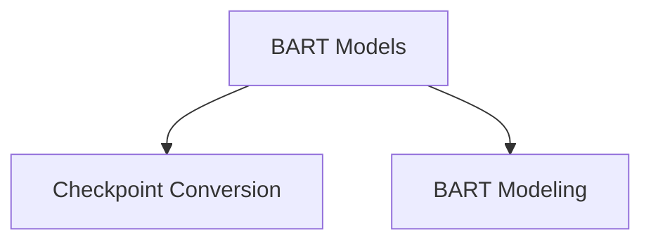

# BART Models Documentation

## Introduction

The `bart_models` module provides implementations and utilities for working with the BART (Bidirectional and Auto-Regressive Transformers) model. This module facilitates the conversion of original BART checkpoints to the Hugging Face format and offers specialized BART models for tasks such as question answering and causal language modeling.

## Architecture

The `bart_models` module is structured into two main sub-modules:

- **Checkpoint Conversion**: Handles the conversion of pre-trained BART checkpoints.
- **Modeling**: Contains the core BART model implementations tailored for specific downstream tasks.

<!-- DIAGRAM_JSON
{
    "direction": "TD",
    "nodes": [
        {"id": "checkpoint_conversion", "label": "Checkpoint Conversion", "type": "module", "link": "checkpoint_conversion.md"},
        {"id": "modeling", "label": "BART Modeling", "type": "module", "link": "modeling.md"}
    ],
    "edges": [
        {"source": "bart_models", "target": "checkpoint_conversion"},
        {"source": "bart_models", "target": "modeling"}
    ],
    "groups": []
}
-->

## Sub-modules

### Checkpoint Conversion

This sub-module provides utilities to convert original BART PyTorch checkpoints into the Hugging Face format, making them compatible with the Transformers library. It ensures that model weights and configurations are correctly mapped during the conversion process.

For more details, refer to the [Checkpoint Conversion](checkpoint_conversion.md) documentation.

### BART Modeling

This sub-module contains the core BART model classes adapted for various natural language processing tasks. Specifically, it includes implementations for question answering and causal language modeling, extending the base BART architecture with task-specific heads.

For more details, refer to the [BART Modeling](modeling.md) documentation.