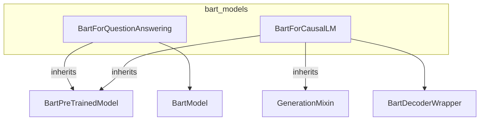

# bart_models
This module provides specialized BART models for various tasks. It includes `BartForQuestionAnswering` for extractive QA and `BartForCausalLM` for causal language modeling, both extending `BartPreTrainedModel`.

<!-- DIAGRAM_JSON
{
  "nodes": [
    {"id": "BartPreTrainedModel", "label": "BartPreTrainedModel", "type": "class"},
    {"id": "BartModel", "label": "BartModel", "type": "class"},
    {"id": "BartDecoderWrapper", "label": "BartDecoderWrapper", "type": "class"},
    {"id": "GenerationMixin", "label": "GenerationMixin", "type": "class"},
    {"id": "BartForQuestionAnswering", "label": "BartForQuestionAnswering", "type": "class"},
    {"id": "BartForCausalLM", "label": "BartForCausalLM", "type": "class"}
  ],
  "edges": [
    {"source": "BartForQuestionAnswering", "target": "BartPreTrainedModel", "type": "inheritance"},
    {"source": "BartForQuestionAnswering", "target": "BartModel", "type": "composition"},
    {"source": "BartForCausalLM", "target": "BartPreTrainedModel", "type": "inheritance"},
    {"source": "BartForCausalLM", "target": "GenerationMixin", "type": "inheritance"},
    {"source": "BartForCausalLM", "target": "BartDecoderWrapper", "type": "composition"}
  ],
  "groups": [
    {"id": "bart_models", "label": "bart_models", "nodes": ["BartForQuestionAnswering", "BartForCausalLM"]}
  ]
}
-->
