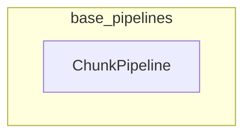

# base_pipelines
This module defines `ChunkPipeline`, a specialized pipeline for processing inputs in chunks, handling preprocessing, forwarding, and postprocessing steps. It also provides an iterator for efficient data loading.

<!-- DIAGRAM_JSON
{
    "nodes": [
        {
            "id": "ChunkPipeline",
            "label": "ChunkPipeline",
            "type": "class",
            "path": "src.transformers.pipelines.base.ChunkPipeline"
        }
    ],
    "edges": [],
    "groups": []
}
-->
