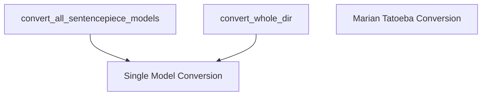

# batch_conversion_utilities Module Documentation

## Introduction

The `batch_conversion_utilities` module provides utility functions for converting multiple Marian models, specifically those based on SentencePiece tokenization, from their original format to a Hugging Face compatible format. This module is designed to streamline the batch processing of model conversions, complementing the single-model conversion functionalities available within the broader [marian_models](marian_models.md) ecosystem.

## Purpose and Core Functionality

This module's primary purpose is to facilitate the large-scale conversion of Marian models. It abstracts away the complexities of iterating through numerous models, handling downloads, and invoking the core conversion logic for each model.

The core functionalities include:

*   **`convert_all_sentencepiece_models`**: This function identifies and converts all Marian models that utilize SentencePiece tokenization. It can fetch model lists from a registry, download models if they don't exist locally, and then apply the conversion process.
*   **`convert_whole_dir`**: This utility is designed to convert all Marian models found within a specified directory. It iterates through subdirectories, applying the conversion to each model it finds.

## Architecture and Component Relationships

The `batch_conversion_utilities` module acts as an orchestration layer for batch conversion tasks. It relies on a lower-level, single-model conversion function (part of the [single_model_conversion](single_model_conversion.md) module) to perform the actual transformation of individual models.

<!-- DIAGRAM_JSON
{
    "direction": "TD",
    "nodes": [
        {"id": "convert_all_sentencepiece_models", "label": "convert_all_sentencepiece_models", "type": "component", "link": null},
        {"id": "convert_whole_dir", "label": "convert_whole_dir", "type": "component", "link": null},
        {"id": "single_model_conversion", "label": "Single Model Conversion", "type": "external", "link": "single_model_conversion.md"},
        {"id": "marian_tatoeba_conversion", "label": "Marian Tatoeba Conversion", "type": "external", "link": "tatoeba_conversion.md"}
    ],
    "edges": [
        {"source": "convert_all_sentencepiece_models", "target": "single_model_conversion"},
        {"source": "convert_whole_dir", "target": "single_model_conversion"}
    ],
    "groups": []
}
-->

### Core Components

*   **`src.transformers.models.marian.convert_marian_to_pytorch.convert_all_sentencepiece_models`**
    *   **Description**: This function iterates through a curated list of Marian models, filters for SentencePiece models, downloads them if not present, and then calls the core `convert` function to transform them into the Hugging Face format. It tracks and returns the paths of all successfully converted models.
    *   **Dependencies**: Relies on an external `make_registry` function to obtain the list of models, `download_and_unzip` for model acquisition, `convert_opus_name_to_hf_name` for naming conventions, and the `convert` function from the [single_model_conversion](single_model_conversion.md) module for the actual conversion logic.

*   **`src.transformers.models.marian.convert_marian_to_pytorch.convert_whole_dir`**
    *   **Description**: Scans a specified directory for Marian model subdirectories and, for each one, invokes the `convert` function to process and convert the model. This is useful for converting a local collection of models.
    *   **Dependencies**: Depends on the `convert` function from the [single_model_conversion](single_model_conversion.md) module to perform the conversion for each individual model directory.

## How the Module Fits into the Overall System

The `batch_conversion_utilities` module is an integral part of the larger `transformers` library, specifically within the [marian_models](marian_models.md) family. It provides essential tools for users and developers who need to convert multiple Marian models efficiently. By providing batch capabilities, it reduces manual effort and potential errors associated with individual model conversions.

It works in conjunction with other `marian_models` conversion utilities, such as the [single_model_conversion](single_model_conversion.md) (which handles the core conversion logic for a single model) and [tatoeba_conversion](tatoeba_conversion.md) (for specific Tatoeba Marian model conversions). This modular approach ensures that different conversion needs are addressed by specialized, yet interconnected, components.

Its outputs (Hugging Face compatible models) are designed to be directly usable by other components of the `transformers` library, enabling seamless integration into various NLP workflows, fine-tuning, and inference tasks.