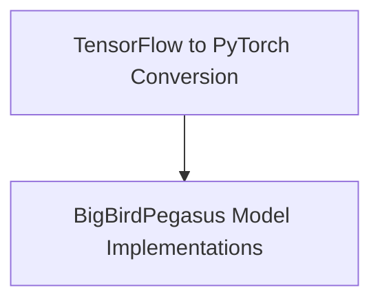

# BigBirdPegasus Models Documentation

This module provides implementations and utilities for working with the BigBirdPegasus model. It includes functionalities for converting TensorFlow checkpoints to PyTorch and various model heads for specific tasks like sequence classification and question answering.

## Architecture

The `bigbird_pegasus_models` module is structured into the following sub-modules:

<!-- DIAGRAM_JSON
{
    "direction": "TD",
    "nodes": [
        {"id": "conversion_utilities", "label": "TensorFlow to PyTorch Conversion", "type": "module", "link": "conversion_utilities.md"},
        {"id": "modeling", "label": "BigBirdPegasus Model Implementations", "type": "module", "link": "modeling.md"}
    ],
    "edges": [
        {"source": "conversion_utilities", "target": "modeling"}
    ],
    "groups": []
}
-->

## Sub-modules

### [Conversion Utilities](conversion_utilities.md)
This sub-module handles the conversion of BigBirdPegasus model checkpoints from TensorFlow to PyTorch. It provides the necessary functions to ensure compatibility and enable the use of pre-trained models within a PyTorch environment.

### [Modeling](modeling.md)
This sub-module contains the core BigBirdPegasus model implementations adapted for specific downstream tasks. It includes classes for sequence classification and question answering, built on top of the BigBirdPegasus architecture.