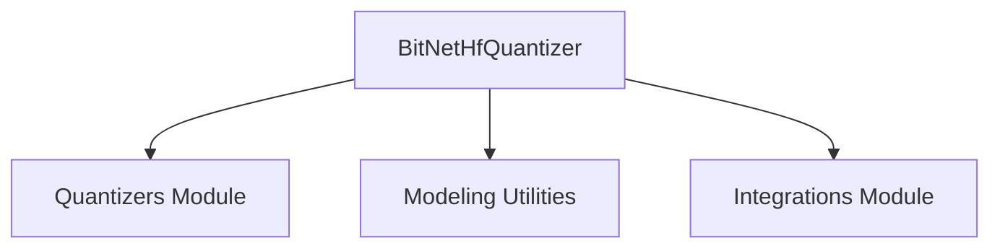

# BitNet Quantizer Module

## Introduction

The `bitnet_quantizer` module provides the implementation for 1.58-bit quantization based on the BitNet quantization method. This module focuses on converting linear layers of a model into `BitLinear` layers during the loading process, enabling highly efficient model inference.

## Purpose and Core Functionality

The primary purpose of the `bitnet_quantizer` module is to facilitate the quantization of models using the BitNet approach. The core functionality is encapsulated within the `BitNetHfQuantizer` class.

### `BitNetHfQuantizer`

`BitNetHfQuantizer` is a specialized quantizer designed to apply 1.58-bit quantization. It extends the base `HfQuantizer` and integrates seamlessly into the Hugging Face Transformers ecosystem.

**Key functionalities and characteristics:**

*   **1.58-bit Quantization:** Implements the quantization scheme described in the BitNet paper (https://huggingface.co/papers/2402.17764).
*   **Layer Conversion:** During model loading, it automatically converts standard linear layers into `BitLinear` layers, which are optimized for BitNet quantization.
*   **Environment Validation:** It includes checks to ensure that the `accelerate` library is installed and that a CUDA device is available for optimal performance. It also warns against loading BitNet models on CPU when a GPU is available, or with device maps that include CPU/disk devices, as this is not supported for efficient BitNet inference.
*   **Model Pre-processing:** The `_process_model_before_weight_loading` method orchestrates the replacement of linear layers. It leverages utility functions from the `integrations` module to perform this conversion.
*   **Memory Adjustment:** It can adjust `max_memory` settings for efficient resource utilization, typically by reducing it by a small percentage.
*   **Serialization:** The quantizer is serializable, meaning its configuration can be saved and reloaded.
*   **Trainability:** Supports quantization-aware training (QAT) when `linear_class` is set to `"autobitlinear"` and `quantization_mode` to `"online"` in its `BitNetQuantConfig`.
*   **Weight Conversions:** Defines specific weight conversion operations using `BitNetDeserialize` for `offline` quantization modes.

## Architecture and Component Relationships

The `bitnet_quantizer` module is a leaf module within the `quantizers` family, specifically nested under `other_quantization_methods`. Its main component, `BitNetHfQuantizer`, interacts with other core components and external modules for its operations.

<!-- DIAGRAM_JSON
{
    "direction": "TD",
    "nodes": [
        {"id": "bitnet_hf_quantizer", "label": "BitNetHfQuantizer", "type": "component", "link": null},
        {"id": "quantizers", "label": "Quantizers Module", "type": "external", "link": "quantizers.md"},
        {"id": "modeling_utilities", "label": "Modeling Utilities", "type": "external", "link": "modeling_utilities.md"},
        {"id": "integrations", "label": "Integrations Module", "type": "external", "link": "integrations.md"}
    ],
    "edges": [
        {"source": "bitnet_hf_quantizer", "target": "quantizers"},
        {"source": "bitnet_hf_quantizer", "target": "modeling_utilities"},
        {"source": "bitnet_hf_quantizer", "target": "integrations"}
    ],
    "groups": []
}
-->

### Component Relationships:

*   **`BitNetHfQuantizer`** is the central component of this module. It inherits from `HfQuantizer`, which is part of the broader [quantizers](quantizers.md) module.
*   It utilizes the `BitNetQuantConfig` for its configuration, which is also expected to be defined within the [quantizers](quantizers.md) module or a related submodule.
*   The `_process_model_before_weight_loading` method takes a `PreTrainedModel` as input, establishing a dependency on the [modeling_utilities](modeling_utilities.md) module.
*   For the actual conversion of linear layers to `BitLinear` and deserialization of weights, it relies on `replace_with_bitnet_linear` and `BitNetDeserialize` from the [integrations](integrations.md) module (specifically `integrations.bitnet`).

## How the Module Fits into the Overall System

The `bitnet_quantizer` module is a crucial part of the quantization framework within the Hugging Face Transformers library. It provides a specific implementation for the BitNet 1.58-bit quantization, enabling memory-efficient and faster inference for models that support this method.

It sits alongside other quantization methods within the `other_quantization_methods` sub-module of [quantizers](quantizers.md), offering a specialized solution for users who wish to leverage BitNet. By abstracting the complex process of converting model layers and handling weight deserialization, it allows developers to easily apply BitNet quantization without deep dives into the underlying mechanics. Its integration with `accelerate` and `torch.cuda` also ensures that it can take advantage of hardware acceleration when available, making it suitable for high-performance applications.