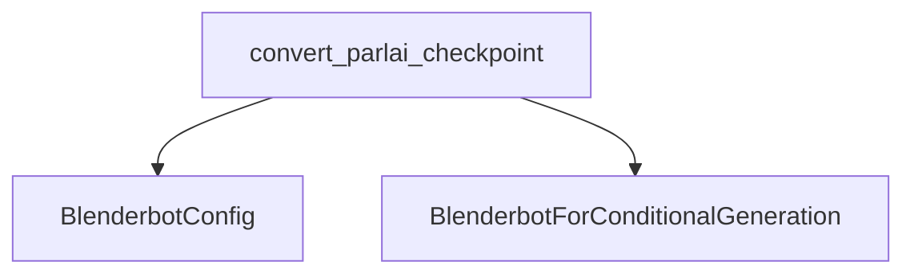

# Module: blenderbot_models

## Introduction

The `blenderbot_models` module is responsible for facilitating the conversion of Blenderbot model checkpoints from their original ParlAI format to a PyTorch-compatible format used by the Hugging Face Transformers library. This module is crucial for enabling the seamless integration and utilization of pre-trained Blenderbot models within the Hugging Face ecosystem.

## Architecture and Component Relationships

The core functionality of the `blenderbot_models` module is encapsulated within the `convert_parlai_checkpoint` function. This function acts as the primary entry point for the conversion process.

### Core Components

- **`convert_parlai_checkpoint`**: This function handles the loading of a ParlAI Blenderbot model checkpoint, extracts its weights, and then maps and transforms these weights to fit the `BlenderbotForConditionalGeneration` architecture. It utilizes a `BlenderbotConfig` to properly configure the target model during the conversion.

### Dependencies

The `convert_parlai_checkpoint` function has the following key dependencies:

- **`torch`**: Used for loading the original ParlAI checkpoint and managing PyTorch tensors.
- **`BlenderbotConfig`**: This configuration object defines the architecture and hyperparameters of the Blenderbot model, guiding the conversion process.
- **`BlenderbotForConditionalGeneration`**: This is the target PyTorch model class in the Hugging Face format, into which the converted weights are loaded.

## How the Module Fits into the Overall System

The `blenderbot_models` module plays a vital role in the `transformers` library by providing the necessary tools to port external Blenderbot models. It ensures that users can leverage pre-trained models from other frameworks without having to retrain them, promoting interoperability and ease of use. This module contributes to the broad range of supported models within the Hugging Face ecosystem, specifically for conditional generation tasks with Blenderbot.

<!-- DIAGRAM_JSON
{
    "direction": "TD",
    "nodes": [
        {"id": "convert_parlai_checkpoint", "label": "convert_parlai_checkpoint", "type": "component", "link": null},
        {"id": "blenderbot_config", "label": "BlenderbotConfig", "type": "external", "link": "blenderbot_config.md"},
        {"id": "blenderbot_modeling", "label": "BlenderbotForConditionalGeneration", "type": "external", "link": "blenderbot_modeling.md"}
    ],
    "edges": [
        {"source": "convert_parlai_checkpoint", "target": "blenderbot_config"},
        {"source": "convert_parlai_checkpoint", "target": "blenderbot_modeling"}
    ],
    "groups": []
}
-->
