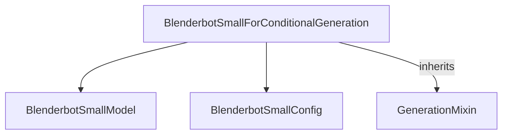

# Blenderbot_small_models Module Documentation

## Introduction

The `blenderbot_small_models` module provides the implementation for the BlenderbotSmall model, a smaller variant of the Blenderbot conversational AI model. This module focuses on the `BlenderbotSmallForConditionalGeneration` class, which is designed for sequence-to-sequence tasks like conditional text generation, typically used in conversational agents.

It extends upon the base functionalities provided by the [generation_mixins](generation_mixins.md) module to enable advanced generation capabilities.

## Architecture and Component Relationships

The core of the `blenderbot_small_models` module is the `BlenderbotSmallForConditionalGeneration` class. This class integrates various components to perform conditional text generation, acting as a complete model for conversational AI tasks.

<!-- DIAGRAM_JSON
{
    "direction": "TD",
    "nodes": [
        {"id": "BlenderbotSmallForConditionalGeneration", "label": "BlenderbotSmallForConditionalGeneration", "type": "component", "link": null},
        {"id": "BlenderbotSmallModel", "label": "BlenderbotSmallModel", "type": "component", "link": null},
        {"id": "BlenderbotSmallConfig", "label": "BlenderbotSmallConfig", "type": "component", "link": null},
        {"id": "GenerationMixin", "label": "GenerationMixin", "type": "external", "link": "generation_mixins.md"}
    ],
    "edges": [
        {"source": "BlenderbotSmallForConditionalGeneration", "target": "BlenderbotSmallModel"},
        {"source": "BlenderbotSmallForConditionalGeneration", "target": "BlenderbotSmallConfig"},
        {"source": "BlenderbotSmallForConditionalGeneration", "target": "GenerationMixin", "label": "inherits"}
    ],
    "groups": []
}
-->

### Core Components

#### BlenderbotSmallForConditionalGeneration

-   **Description:** This class is the primary model for conditional text generation in the BlenderbotSmall architecture. It combines an encoder-decoder architecture with a language modeling head (`lm_head`) for generating responses. It inherits from `BlenderbotSmallPreTrainedModel` (for shared functionalities common to BlenderbotSmall models) and `GenerationMixin` (to provide utilities for text generation, such as beam search decoding, sampling, etc.).
-   **Key Features:**
    -   **Initialization:** Sets up the `BlenderbotSmallModel` as the core encoder-decoder and initializes a linear layer `lm_head` for vocabulary projection.
    -   **Token Embedding Resizing:** Provides methods to resize token embeddings and adjust the `final_logits_bias` accordingly.
    -   **Forward Pass:** Processes `input_ids` and `decoder_input_ids` through the `BlenderbotSmallModel` to produce `lm_logits`. It can also compute a masked language modeling loss if `labels` are provided.
    -   **Conditional Generation:** Leverages `GenerationMixin` for powerful text generation capabilities, allowing the model to generate coherent and contextually relevant responses based on input prompts.
-   **Usage Example (from code):** The provided example demonstrates how to use the model with a tokenizer to generate conversational responses.

## How the Module Fits into the Overall System

The `blenderbot_small_models` module is a specific implementation within the larger `transformers.models` ecosystem. It provides a compact yet capable conversational AI model that can be easily integrated into applications requiring natural language generation. Its dependency on [generation_mixins](generation_mixins.md) highlights its reliance on generalized text generation utilities, making it compatible with the broader Hugging Face Transformers library's generation capabilities.

It is conceptually related to the [blenderbot_models](blenderbot_models.md) module, which likely provides the full-sized Blenderbot model, offering a smaller, more efficient alternative for scenarios where computational resources are limited or a less complex model is preferred. This modular design allows developers to choose the appropriate model size based on their specific needs, while maintaining a consistent API and integration pattern across different models.