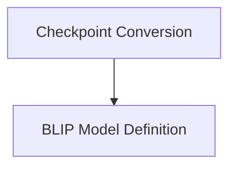

# BLIP Models Documentation

The `blip_models` module provides implementations and utilities for the **BLIP (Bootstrapping Language-Image Pre-training)** models. It encompasses functionalities for converting original BLIP checkpoints to the Hugging Face format and defines the core BLIP model architecture for various vision-language tasks.

## Architecture Overview

The `blip_models` module is structured into two main logical components:

1.  **Checkpoint Conversion**: Utilities to facilitate the migration of pre-trained BLIP models from their original format to the Hugging Face ecosystem.
2.  **Core Modeling**: The foundational BLIP model definition, which includes its text and vision components, and methods for multimodal feature extraction and fusion.

These components work in tandem to enable seamless integration and utilization of BLIP models within the Hugging Face Transformers library.

<!-- DIAGRAM_JSON
{
    "direction": "TD",
    "nodes": [
        {"id": "conversion_utilities", "label": "Checkpoint Conversion", "type": "module", "link": "conversion_utilities.md"},
        {"id": "modeling", "label": "BLIP Model Definition", "type": "module", "link": "modeling.md"}
    ],
    "edges": [
        {"source": "conversion_utilities", "target": "modeling"}
    ],
    "groups": []
}
-->

## Sub-modules

*   **[Checkpoint Conversion](conversion_utilities.md)**: This sub-module contains the logic for converting original BLIP PyTorch checkpoints into the Hugging Face compatible format, ensuring that pre-trained weights can be easily loaded and used.

*   **[BLIP Model Definition](modeling.md)**: This sub-module defines the fundamental `BlipModel` class, which integrates the vision and text encoders, and provides methods for generating image and text features, as well as multimodal embeddings.