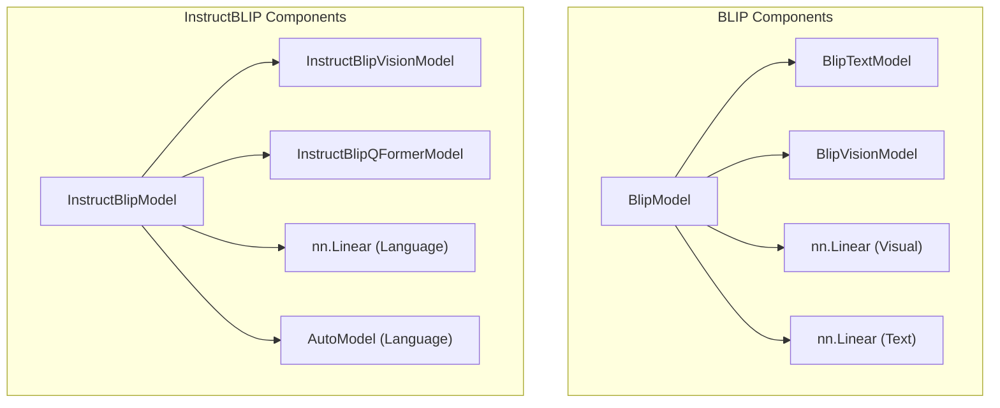

# blip_models
This module provides the core implementations for the BLIP and InstructBLIP models, integrating vision and text components for various multimodal tasks.

<!-- DIAGRAM_JSON
{
  "nodes": [
    {"id": "BlipModel", "label": "BlipModel"},
    {"id": "BlipTextModel", "label": "BlipTextModel"},
    {"id": "BlipVisionModel", "label": "BlipVisionModel"},
    {"id": "BlipVisualProjection", "label": "nn.Linear (Visual)"},
    {"id": "BlipTextProjection", "label": "nn.Linear (Text)"},
    {"id": "InstructBlipModel", "label": "InstructBlipModel"},
    {"id": "InstructBlipVisionModel", "label": "InstructBlipVisionModel"},
    {"id": "InstructBlipQFormerModel", "label": "InstructBlipQFormerModel"},
    {"id": "InstructBlipLanguageProjection", "label": "nn.Linear (Language)"},
    {"id": "InstructBlipLanguageModel", "label": "AutoModel (Language)"}
  ],
  "edges": [
    {"source": "BlipModel", "target": "BlipTextModel", "label": "uses"},
    {"source": "BlipModel", "target": "BlipVisionModel", "label": "uses"},
    {"source": "BlipModel", "target": "BlipVisualProjection", "label": "uses"},
    {"source": "BlipModel", "target": "BlipTextProjection", "label": "uses"},
    {"source": "InstructBlipModel", "target": "InstructBlipVisionModel", "label": "uses"},
    {"source": "InstructBlipModel", "target": "InstructBlipQFormerModel", "label": "uses"},
    {"source": "InstructBlipModel", "target": "InstructBlipLanguageProjection", "label": "uses"},
    {"source": "InstructBlipModel", "target": "InstructBlipLanguageModel", "label": "uses"}
  ],
  "groups": [
    {"id": "BlipGroup", "label": "BLIP Components", "nodes": ["BlipModel", "BlipTextModel", "BlipVisionModel", "BlipVisualProjection", "BlipTextProjection"]},
    {"id": "InstructBlipGroup", "label": "InstructBLIP Components", "nodes": ["InstructBlipModel", "InstructBlipVisionModel", "InstructBlipQFormerModel", "InstructBlipLanguageProjection", "InstructBlipLanguageModel"]}
  ]
}
-->
