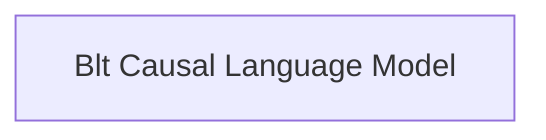

# BLT Models Documentation

The `blt_models` module provides the core implementation for the Bidirectional Language-Image Transformer (BLT) architecture, focusing on causal language modeling capabilities. This module enables text generation tasks that can optionally incorporate visual information through cross-attention mechanisms.

## Architecture Overview

The `blt_models` module primarily centers around its Causal Language Model. This model extends standard causal language modeling by allowing attention to visual features, making it suitable for multimodal tasks.

<!-- DIAGRAM_JSON
{
    "direction": "TD",
    "nodes": [
        {"id": "causal_lm_model", "label": "Blt Causal Language Model", "type": "module", "link": "causal_lm_model.md"}
    ],
    "edges": [],
    "groups": []
}
-->

## Sub-modules

### Blt Causal Language Model
The `causal_lm_model` sub-module provides the `BltForCausalLM` class, which is a powerful model designed for causal language modeling. It supports text generation and can leverage cross-attention to incorporate visual features, making it ideal for multimodal tasks. This model handles input processing, attention mechanisms, and loss computation for language generation based on text and optional image inputs.

For more detailed information, please refer to the [Blt Causal Language Model documentation](causal_lm_model.md).
