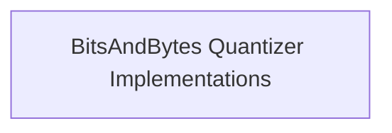

# BNB Quantizers Module Documentation

## Introduction

The `bnb_quantizers` module provides implementations for 4-bit and 8-bit quantization methods using the `bitsandbytes` library. These quantizers are crucial for optimizing model memory footprint and accelerating inference, especially for large language models. They integrate seamlessly with the Hugging Face Transformers library, allowing for efficient loading and deployment of quantized models.

## Architecture Overview

The `bnb_quantizers` module is a part of the broader `quantizers` system, focusing specifically on `bitsandbytes` based quantization. It offers distinct quantizers for 4-bit and 8-bit precision, each handling the specific requirements and optimizations for their respective bit-widths. These quantizers interact with the model loading and processing pipeline to replace standard linear layers with their quantized counterparts.

<!-- DIAGRAM_JSON
{
    "direction": "TD",
    "nodes": [
        {"id": "bnb_quantizers_implementations", "label": "BitsAndBytes Quantizer Implementations", "type": "module", "link": "bnb_quantizers_implementations.md"}
    ],
    "edges": [],
    "groups": []
}
-->

## High-Level Functionality

- **[BitsAndBytes Quantizer Implementations](bnb_quantizers_implementations.md)**: This sub-module contains the core logic for 4-bit and 8-bit quantization, including environment validation, memory adjustment, model processing before and after weight loading, and serialization capabilities.