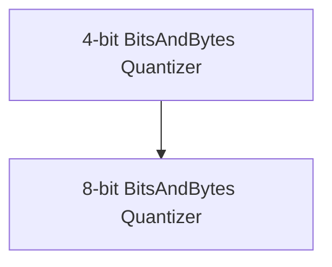

# bnb_quantizers_implementations Module Documentation

## Introduction

The `bnb_quantizers_implementations` module provides the core implementations for BitsAndBytes 4-bit and 8-bit quantization within the Transformers library. These quantizers enable efficient memory usage and faster inference for large language models by reducing the precision of model weights.

## Architecture Overview

This module is part of the larger `quantizers` module and focuses specifically on integrating BitsAndBytes quantization methods. It defines the classes and logic required to apply 4-bit and 8-bit quantization to models, manage device mapping, and handle serialization/deserialization of quantized weights.

<!-- DIAGRAM_JSON
{
    "direction": "TD",
    "nodes": [
        {"id": "bnb_4bit_quantizer", "label": "4-bit BitsAndBytes Quantizer", "type": "module", "link": "bnb_4bit_quantizer.md"},
        {"id": "bnb_8bit_quantizer", "label": "8-bit BitsAndBytes Quantizer", "type": "module", "link": "bnb_8bit_quantizer.md"}
    ],
    "edges": [
        {"source": "bnb_4bit_quantizer", "target": "bnb_8bit_quantizer", "label": "Shares BNB integration"}
    ],
    "groups": []
}
-->

## Sub-modules

### [4-bit BitsAndBytes Quantizer](bnb_4bit_quantizer.md)

This sub-module implements the `Bnb4BitHfQuantizer`, which provides functionality for 4-bit quantization using the `bitsandbytes` library. It includes methods for environment validation, memory adjustment, device map updates, and the actual process of quantizing and de-quantizing model weights to 4-bit precision.

### [8-bit BitsAndBytes Quantizer](bnb_8bit_quantizer.md)

The `8-bit BitsAndBytes Quantizer` sub-module houses the `Bnb8BitHfQuantizer`. This quantizer enables 8-bit quantization for models, leveraging the `bitsandbytes` library to reduce memory footprint while maintaining reasonable performance. It handles similar responsibilities to its 4-bit counterpart, including environment checks and model processing during loading and de-quantization.
