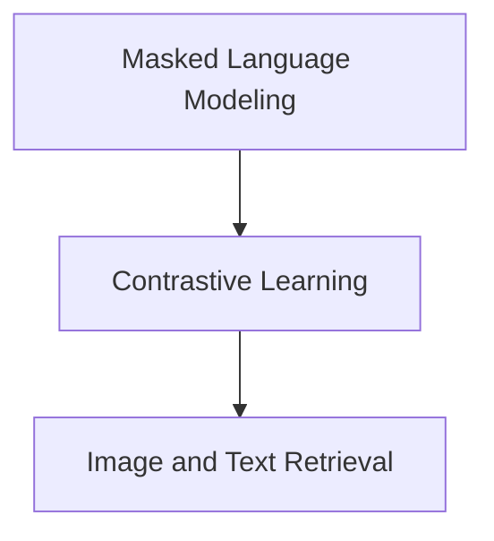

# BridgeTower Models Module

The `bridgetower_models` module provides specialized implementations of the BridgeTower architecture, a powerful model designed for multimodal understanding and tasks involving both images and text. This module encapsulates various applications of BridgeTower, including masked language modeling, contrastive learning for image-text similarity, and image-text retrieval. It serves as a central hub for leveraging BridgeTower's capabilities across different downstream tasks.

## Architecture Overview

The `bridgetower_models` module is composed of several key sub-modules, each focusing on a specific multimodal task. These sub-modules build upon a shared BridgeTower base model, extending its functionality for specialized applications.

<!-- DIAGRAM_JSON
{
    "direction": "TD",
    "nodes": [
        {"id": "masked_lm", "label": "Masked Language Modeling", "type": "module", "link": "masked_lm.md"},
        {"id": "contrastive_learning", "label": "Contrastive Learning", "type": "module", "link": "contrastive_learning.md"},
        {"id": "image_text_retrieval", "label": "Image and Text Retrieval", "type": "module", "link": "image_text_retrieval.md"}
    ],
    "edges": [
        {"source": "masked_lm", "target": "contrastive_learning"},
        {"source": "contrastive_learning", "target": "image_text_retrieval"}
    ],
    "groups": []
}
-->

## Sub-modules

This module organizes the BridgeTower model into the following sub-modules, each designed for a distinct set of functionalities:

*   **[Masked Language Modeling](masked_lm.md)**: This sub-module provides the `BridgeTowerForMaskedLM` class, enabling the model to perform masked language modeling tasks on text inputs, leveraging its multimodal understanding.

*   **[Contrastive Learning](contrastive_learning.md)**: The `BridgeTowerForContrastiveLearning` class within this sub-module facilitates contrastive learning, allowing the model to learn robust representations by maximizing agreement between different views of the same data (e.g., image and text).

*   **[Image and Text Retrieval](image_text_retrieval.md)**: This sub-module contains the `BridgeTowerForImageAndTextRetrieval` class, which is used for tasks involving retrieving relevant images for a given text query or vice versa, by calculating image-text matching scores.