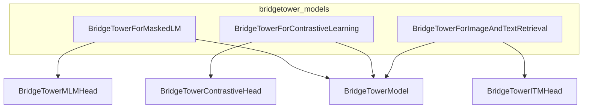

# bridgetower_models
The `bridgetower_models` module provides various BridgeTower model heads for specific tasks, including masked language modeling, contrastive learning, and image-text retrieval, all built upon a shared BridgeTower backbone.

<!-- DIAGRAM_JSON
{
    "nodes": [
        {
            "id": "BridgeTowerForMaskedLM",
            "label": "BridgeTowerForMaskedLM",
            "type": "class"
        },
        {
            "id": "BridgeTowerForContrastiveLearning",
            "label": "BridgeTowerForContrastiveLearning",
            "type": "class"
        },
        {
            "id": "BridgeTowerForImageAndTextRetrieval",
            "label": "BridgeTowerForImageAndTextRetrieval",
            "type": "class"
        },
        {
            "id": "BridgeTowerModel",
            "label": "BridgeTowerModel",
            "type": "class"
        },
        {
            "id": "BridgeTowerMLMHead",
            "label": "BridgeTowerMLMHead",
            "type": "class"
        },
        {
            "id": "BridgeTowerContrastiveHead",
            "label": "BridgeTowerContrastiveHead",
            "type": "class"
        },
        {
            "id": "BridgeTowerITMHead",
            "label": "BridgeTowerITMHead",
            "type": "class"
        }
    ],
    "edges": [
        {
            "source": "BridgeTowerForMaskedLM",
            "target": "BridgeTowerModel",
            "label": "uses"
        },
        {
            "source": "BridgeTowerForMaskedLM",
            "target": "BridgeTowerMLMHead",
            "label": "uses"
        },
        {
            "source": "BridgeTowerForContrastiveLearning",
            "target": "BridgeTowerModel",
            "label": "uses"
        },
        {
            "source": "BridgeTowerForContrastiveLearning",
            "target": "BridgeTowerContrastiveHead",
            "label": "uses"
        },
        {
            "source": "BridgeTowerForImageAndTextRetrieval",
            "target": "BridgeTowerModel",
            "label": "uses"
        },
        {
            "source": "BridgeTowerForImageAndTextRetrieval",
            "target": "BridgeTowerITMHead",
            "label": "uses"
        }
    ],
    "groups": [
        {
            "id": "bridgetower_models",
            "label": "bridgetower_models",
            "nodes": [
                "BridgeTowerForMaskedLM",
                "BridgeTowerForContrastiveLearning",
                "BridgeTowerForImageAndTextRetrieval"
            ]
        }
    ]
}
-->
