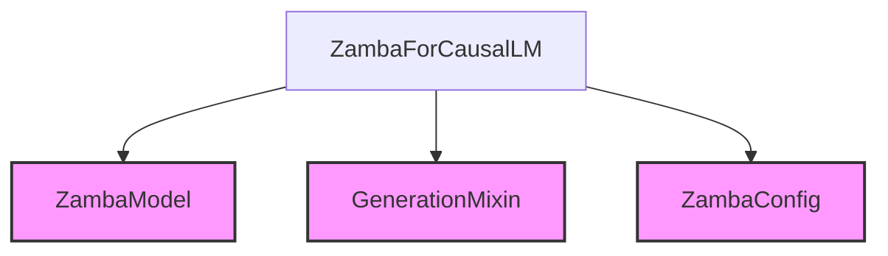

# Module: `causal_language_modeling`

## Introduction
The `causal_language_modeling` module is a sub-module within the `zamba_models` family, specifically designed to implement causal language modeling capabilities for the Zamba architecture. Its primary component, `ZambaForCausalLM`, provides the necessary functionalities for tasks such as text generation and next-token prediction based on the Zamba model.

## Architecture and Component Relationships
The core of this module is the `ZambaForCausalLM` class. This class integrates the foundational `ZambaModel` for its architectural backbone, utilizes `GenerationMixin` to enable powerful text generation capabilities, and relies on `ZambaConfig` for its operational parameters and configuration.

### `ZambaForCausalLM`
The `ZambaForCausalLM` class is a specialized model that extends `ZambaPreTrainedModel` and includes the `GenerationMixin`. It consists of:
-   **`model`**: An instance of `ZambaModel`, which represents the main Zamba model architecture.
-   **`lm_head`**: A linear layer that projects the hidden states from the `ZambaModel` into the vocabulary space to produce logits for causal language modeling.

The `forward` method processes input sequences, computes hidden states using the internal `ZambaModel`, and then generates logits. If labels are provided, it also calculates the causal language modeling loss. The `prepare_inputs_for_generation` method facilitates efficient text generation by preparing inputs for iterative decoding.

## Module Diagram

<!-- DIAGRAM_JSON
{
    "direction": "TD",
    "nodes": [
        {"id": "zamba_causal_lm", "label": "ZambaForCausalLM", "type": "component", "link": null},
        {"id": "zamba_model", "label": "ZambaModel", "type": "external", "link": "zamba_models.md"},
        {"id": "generation_mixin", "label": "GenerationMixin", "type": "external", "link": "generation_mixins.md"},
        {"id": "zamba_config", "label": "ZambaConfig", "type": "external", "link": "zamba_models.md"}
    ],
    "edges": [
        {"source": "zamba_causal_lm", "target": "zamba_model"},
        {"source": "zamba_causal_lm", "target": "generation_mixin"},
        {"source": "zamba_causal_lm", "target": "zamba_config"}
    ],
    "groups": []
}
-->

## Integration with the Overall System
The `causal_language_modeling` module provides the foundational components for enabling causal language modeling tasks within the broader Zamba ecosystem. It serves as the primary interface for users and other modules that require text generation, auto-regressive prediction, or fine-tuning of Zamba models for language generation specific tasks. It is a specialized extension of the core [zamba_models](zamba_models.md) functionality.

For more details on text generation utilities, refer to the [generation_mixins](generation_mixins.md) documentation.
For general Zamba model architecture and configuration, refer to the [zamba_models](zamba_models.md) documentation.