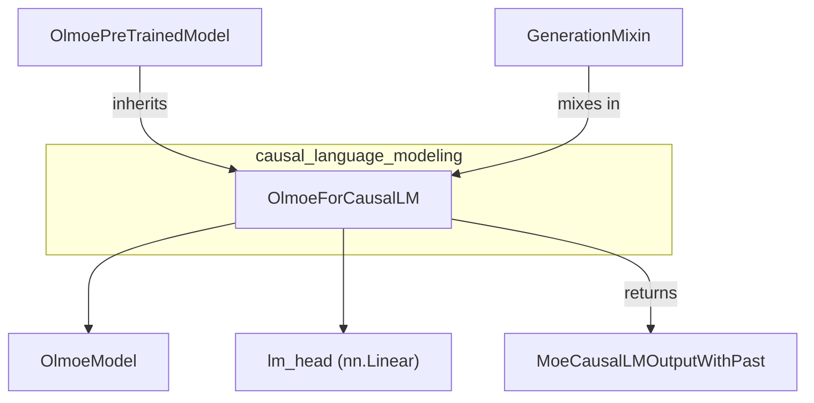

# Causal Language Modeling
This module provides the `OlmoeForCausalLM` class, an Olmoe model configured for causal language modeling tasks, extending `OlmoePreTrainedModel` and `GenerationMixin`. It integrates an `OlmoeModel` and a linear head for token prediction.

<!-- DIAGRAM_JSON
{
  "nodes": [
    {
      "id": "OlmoeForCausalLM",
      "label": "OlmoeForCausalLM",
      "type": "class"
    },
    {
      "id": "OlmoePreTrainedModel",
      "label": "OlmoePreTrainedModel",
      "type": "class"
    },
    {
      "id": "GenerationMixin",
      "label": "GenerationMixin",
      "type": "class"
    },
    {
      "id": "OlmoeModel",
      "label": "OlmoeModel",
      "type": "class"
    },
    {
      "id": "MoeCausalLMOutputWithPast",
      "label": "MoeCausalLMOutputWithPast",
      "type": "class"
    },
    {
      "id": "lm_head",
      "label": "lm_head (nn.Linear)",
      "type": "component"
    }
  ],
  "edges": [
    {
      "source": "OlmoePreTrainedModel",
      "target": "OlmoeForCausalLM",
      "type": "inherits"
    },
    {
      "source": "GenerationMixin",
      "target": "OlmoeForCausalLM",
      "type": "inherits"
    },
    {
      "source": "OlmoeForCausalLM",
      "target": "OlmoeModel",
      "type": "composes"
    },
    {
      "source": "OlmoeForCausalLM",
      "target": "lm_head",
      "type": "composes"
    },
    {
      "source": "OlmoeForCausalLM",
      "target": "MoeCausalLMOutputWithPast",
      "type": "returns"
    }
  ],
  "groups": [
    {
      "id": "causal_language_modeling",
      "label": "causal_language_modeling",
      "nodes": ["OlmoeForCausalLM"]
    }
  ]
}
-->
```
