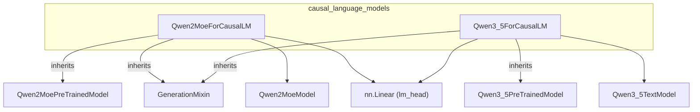

# Causal Language Models
This module provides implementations of Causal Language Models, including the Qwen2-MoE and Qwen3.5 architectures, designed for efficient text generation tasks.

<!-- DIAGRAM_JSON
{
  "nodes": [
    {
      "id": "Qwen2MoeForCausalLM",
      "label": "Qwen2MoeForCausalLM",
      "type": "class"
    },
    {
      "id": "Qwen3_5ForCausalLM",
      "label": "Qwen3_5ForCausalLM",
      "type": "class"
    },
    {
      "id": "Qwen2MoePreTrainedModel",
      "label": "Qwen2MoePreTrainedModel",
      "type": "class"
    },
    {
      "id": "Qwen3_5PreTrainedModel",
      "label": "Qwen3_5PreTrainedModel",
      "type": "class"
    },
    {
      "id": "GenerationMixin",
      "label": "GenerationMixin",
      "type": "class"
    },
    {
      "id": "Qwen2MoeModel",
      "label": "Qwen2MoeModel",
      "type": "class"
    },
    {
      "id": "Qwen3_5TextModel",
      "label": "Qwen3_5TextModel",
      "type": "class"
    },
    {
      "id": "nn.Linear",
      "label": "nn.Linear (lm_head)",
      "type": "class"
    }
  ],
  "edges": [
    {
      "source": "Qwen2MoeForCausalLM",
      "target": "Qwen2MoePreTrainedModel",
      "type": "inherits"
    },
    {
      "source": "Qwen2MoeForCausalLM",
      "target": "GenerationMixin",
      "type": "inherits"
    },
    {
      "source": "Qwen2MoeForCausalLM",
      "target": "Qwen2MoeModel",
      "type": "uses"
    },
    {
      "source": "Qwen2MoeForCausalLM",
      "target": "nn.Linear",
      "type": "uses"
    },
    {
      "source": "Qwen3_5ForCausalLM",
      "target": "Qwen3_5PreTrainedModel",
      "type": "inherits"
    },
    {
      "source": "Qwen3_5ForCausalLM",
      "target": "GenerationMixin",
      "type": "inherits"
    },
    {
      "source": "Qwen3_5ForCausalLM",
      "target": "Qwen3_5TextModel",
      "type": "uses"
    },
    {
      "source": "Qwen3_5ForCausalLM",
      "target": "nn.Linear",
      "type": "uses"
    }
  ],
  "groups": [
    {
      "id": "causal_language_models",
      "label": "causal_language_models",
      "contains": ["Qwen2MoeForCausalLM", "Qwen3_5ForCausalLM"]
    }
  ]
}
-->
```
