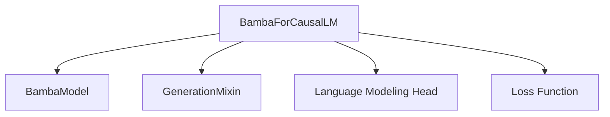

# `causal_lm` Module Documentation

The `causal_lm` module within the `bamba_models` package is responsible for implementing the Causal Language Model (CLM) based on the Bamba architecture. This module provides the `BambaForCausalLM` class, which extends the core Bamba model with a language modeling head, enabling it to perform tasks like text generation and masked language modeling.

## Architecture and Core Components

### `BambaForCausalLM`

`BambaForCausalLM` is the primary class in this module. It is designed for causal language modeling and inherits from `BambaPreTrainedModel` (not detailed in core components, but implied by the context of `BambaModel`) and `GenerationMixin`. This inheritance provides the fundamental model structure and text generation capabilities.

**Key functionalities of `BambaForCausalLM`:**

- **Causal Language Modeling Head:** It includes a linear layer (`lm_head`) on top of the `BambaModel`\'s hidden states to predict the next token in a sequence.
- **Text Generation:** By inheriting from `GenerationMixin` (see [generation_mixins.md](generation_mixins.md)), it supports various text generation strategies.
- **Loss Calculation:** It computes the causal language modeling loss, optionally incorporating a Z-loss for regularization.
- **Input Handling:** It processes `input_ids`, `attention_mask`, `position_ids`, and manages `past_key_values` for efficient sequence generation.

#### Component Relationships

`BambaForCausalLM` leverages the `BambaModel` (documented in [bamba_models_core_model.md](bamba_models_core_model.md)) for its base transformer architecture. The `lm_head` is directly connected to the `BambaModel`\'s output to perform token prediction.

<!-- DIAGRAM_JSON
{
    "direction": "TD",
    "nodes": [
        {"id": "bamba_for_causal_lm", "label": "BambaForCausalLM", "type": "component", "link": null},
        {"id": "bamba_model", "label": "BambaModel", "type": "external", "link": "bamba_models_core_model.md"},
        {"id": "generation_mixin", "label": "GenerationMixin", "type": "external", "link": "generation_mixins.md"},
        {"id": "lm_head", "label": "Language Modeling Head", "type": "component", "link": null},
        {"id": "loss_function", "label": "Loss Function", "type": "component", "link": null}
    ],
    "edges": [
        {"source": "bamba_for_causal_lm", "target": "bamba_model"},
        {"source": "bamba_for_causal_lm", "target": "generation_mixin"},
        {"source": "bamba_for_causal_lm", "target": "lm_head"},
        {"source": "bamba_for_causal_lm", "target": "loss_function"}
    ],
    "groups": []
}
-->


## How it Fits into the Overall System

The `causal_lm` module provides the capability to use the Bamba model for text generation and other causal language modeling tasks. It extends the foundational `BambaModel` with task-specific heads and generation utilities, making it a complete solution for generative AI applications based on the Bamba architecture. It integrates with the broader Transformers ecosystem through `GenerationMixin`, allowing it to leverage common generation strategies and utilities.


## Introduction

The `causal_lm` module provides the `Gemma4ForCausalLM` class, a causal language model specifically designed for the Gemma4 architecture. This module is a core component for generative text tasks within the Transformers library, enabling functionalities like text generation and sequence completion.

## Architecture and Component Relationships

`Gemma4ForCausalLM` is built upon the `Gemma4TextModel` for its underlying transformer layers and leverages the `GenerationMixin` for common generation functionalities. It incorporates a linear head (`lm_head`) to project the model's hidden states to the vocabulary space, facilitating token prediction. The model is designed to be configurable via `Gemma4TextConfig`.

<!-- DIAGRAM_JSON
{
    "direction": "TD",
    "nodes": [
        {"id": "gemma4_causal_lm", "label": "Gemma4ForCausalLM", "type": "component", "link": null},
        {"id": "gemma4_text_model", "label": "Gemma4TextModel", "type": "external", "link": "text_model.md"},
        {"id": "lm_head", "label": "lm_head (Linear Layer)", "type": "component", "link": null},
        {"id": "generation_mixin", "label": "GenerationMixin", "type": "external", "link": "generation_mixins.md"},
        {"id": "gemma4_pretrained_model", "label": "Gemma4PreTrainedModel", "type": "external", "link": "modeling_gemma4.md"},
        {"id": "gemma4_text_config", "label": "Gemma4TextConfig", "type": "external", "link": null},
        {"id": "causal_lm_output_with_past", "label": "CausalLMOutputWithPast", "type": "external", "link": null},
        {"id": "base_model_output_with_past", "label": "BaseModelOutputWithPast", "type": "external", "link": null},
        {"id": "cache", "label": "Cache", "type": "external", "link": null}
    ],
    "edges": [
        {"source": "gemma4_causal_lm", "target": "gemma4_pretrained_model"},
        {"source": "gemma4_causal_lm", "target": "generation_mixin"},
        {"source": "gemma4_causal_lm", "target": "gemma4_text_model"},
        {"source": "gemma4_causal_lm", "target": "lm_head"},
        {"source": "gemma4_causal_lm", "target": "gemma4_text_config"},
        {"source": "gemma4_causal_lm", "target": "cache"},
        {"source": "gemma4_text_model", "target": "base_model_output_with_past"},
        {"source": "gemma4_causal_lm", "target": "causal_lm_output_with_past"}
    ],
    "groups": []
}
-->

```mermaid
graph TD
    gemma4_causal_lm[Gemma4ForCausalLM]
    gemma4_text_model[Gemma4TextModel]
    lm_head[lm_head (Linear Layer)]
    generation_mixin[GenerationMixin]
    gemma4_pretrained_model[Gemma4PreTrainedModel]
    gemma4_text_config[Gemma4TextConfig]
    causal_lm_output_with_past[CausalLMOutputWithPast]
    base_model_output_with_past[BaseModelOutputWithPast]
    cache[Cache]

    gemma4_causal_lm --> gemma4_pretrained_model
    gemma4_causal_lm --> generation_mixin
    gemma4_causal_lm --> gemma4_text_model
    gemma4_causal_lm --> lm_head
    gemma4_causal_lm --> gemma4_text_config
    gemma4_causal_lm --> cache
    gemma4_text_model --> base_model_output_with_past
    gemma4_causal_lm --> causal_lm_output_with_past
```

### `Gemma4ForCausalLM`

-   **Purpose**: Implements the causal language modeling head for the Gemma4 model, enabling next-token prediction and text generation.
-   **Core Functionality**:
    -   Initializes with a `Gemma4TextModel` instance and a linear layer (`lm_head`) for vocabulary projection.
    -   The `forward` method processes input IDs, attention masks, and other parameters through the `Gemma4TextModel` to obtain hidden states. These hidden states are then passed through the `lm_head` to produce logits.
    -   Optionally calculates the causal language modeling loss if `labels` are provided.
    -   Supports `past_key_values` for efficient sequential generation and `use_cache` for performance optimization.
-   **Relationships**:
    -   **Inherits from**: `Gemma4PreTrainedModel` (provides common pre-trained model functionalities) and `GenerationMixin` ([generation_mixins.md](generation_mixins.md)) (enables various text generation strategies).
    -   **Composes**: `Gemma4TextModel` ([text_model.md](text_model.md)) (the core transformer block of the Gemma4 architecture).
    -   **Uses**: `Gemma4TextConfig` (for model configuration), `Cache` (for managing key-value pairs in self-attention during generation), `CausalLMOutputWithPast` (return type for the forward pass), `BaseModelOutputWithPast` (output from `Gemma4TextModel`).

## How the Module Fits into the Overall System

This `causal_lm` module is a specialized component within the `gemma4_models` ecosystem, providing the essential capabilities for text generation. It serves as the entry point for tasks requiring the Gemma4 model to produce sequential text output, building upon the foundational `Gemma4TextModel`. Its integration with `GenerationMixin` ensures compatibility with the broader text generation utilities available in the Transformers library, allowing for diverse decoding strategies such as beam search, sampling, and more. It is a leaf module that provides the `Gemma4ForCausalLM` for specific NLP applications.