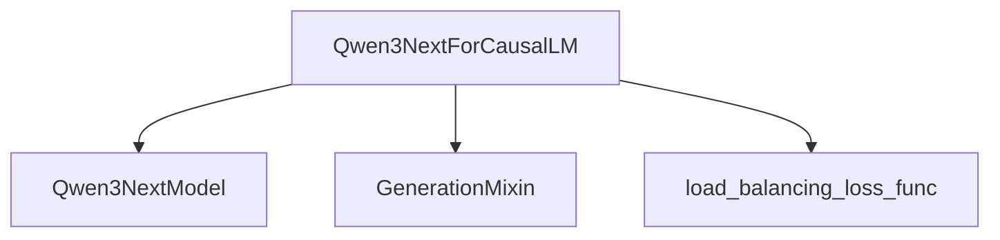

# Causal LM Model (causal_lm_model)

The `causal_lm_model` module provides the core implementation for causal language modeling within the Qwen3Next model family. It focuses on the `Qwen3NextForCausalLM` class, which is designed for generating text sequences based on a given prompt.

## Core Functionality

The primary component of this module is `Qwen3NextForCausalLM`:

### `Qwen3NextForCausalLM`

-   **Purpose**: This class represents a Causal Language Model for the Qwen3Next architecture, specifically designed for next-token prediction and text generation tasks.
-   **Initialization**: It initializes with a `Qwen3NextModel` instance (the base model backbone) and a linear layer (`lm_head`) responsible for mapping hidden states to the vocabulary space to predict the next token. It also configures parameters related to the Mixture-of-Experts (MoE) architecture, such as `router_aux_loss_coef`, `num_experts`, and `num_experts_per_tok`.
-   **`forward` Method**: This method processes input sequences to generate logits for the next token prediction. Key functionalities include:
    -   Passing inputs through the underlying `Qwen3NextModel` to obtain hidden states.
    -   Applying the `lm_head` to these hidden states to compute raw prediction scores (logits).
    -   Optionally calculating a language modeling loss if `labels` are provided.
    -   Crucially, if the model is configured for MoE (`output_router_logits` is true), it computes and adds a load balancing auxiliary loss (`load_balancing_loss_func`) to ensure experts are utilized efficiently. This auxiliary loss contributes to the overall loss, weighted by `router_aux_loss_coef`.
-   **Output**: It returns a `MoeCausalLMOutputWithPast` object, encapsulating the computed loss, auxiliary loss, logits, past key-values for efficient generation, hidden states, attentions, and router logits.

## Architecture and Component Relationships

The `causal_lm_model` module's `Qwen3NextForCausalLM` component integrates with the base Qwen3Next model architecture and leverages utility functions for generation and MoE-specific loss computation.

<!-- DIAGRAM_JSON
{
    "direction": "TD",
    "nodes": [
        {"id": "qwen3next_causallm", "label": "Qwen3NextForCausalLM", "type": "component", "link": null},
        {"id": "qwen3next_model", "label": "Qwen3NextModel", "type": "external", "link": "qwen3_next_models.md"},
        {"id": "generation_mixin", "label": "GenerationMixin", "type": "external", "link": "generation_mixins.md"},
        {"id": "moe_loss_func", "label": "load_balancing_loss_func", "type": "external", "link": "modeling_utilities.md"}
    ],
    "edges": [
        {"source": "qwen3next_causallm", "target": "qwen3next_model"},
        {"source": "qwen3next_causallm", "target": "generation_mixin"},
        {"source": "qwen3next_causallm", "target": "moe_loss_func"}
    ],
    "groups": []
}
-->

## Module Integration

The `causal_lm_model` module is a crucial part of the `qwen3_next_models` package, providing the specific Causal Language Model head that sits on top of the base `Qwen3NextModel` architecture. It enables text generation capabilities and incorporates the Mixture-of-Experts (MoE) routing and loss mechanisms inherent to the Qwen3Next design. It relies on the core model components defined within the broader `qwen3_next_models` module (likely in `core_architecture.md`) and utilizes general utilities from modules like `generation_mixins.md` for common generation functionalities and `modeling_utilities.md` for specific loss functions related to MoE.