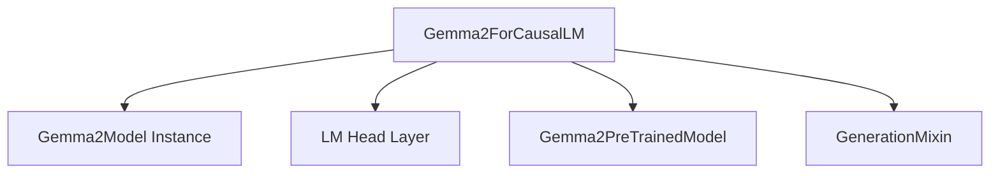

# Module: `gemma2_causal_lm_modeling`

The `causal_lm_modeling` module provides the core functionality for causal language modeling using the Gemma2 architecture, specifically through the `Gemma2ForCausalLM` class.

## Purpose and Core Functionality

The `Gemma2ForCausalLM` class is designed to perform causal language modeling tasks, such as text generation. It extends the foundational `Gemma2PreTrainedModel` and integrates the `GenerationMixin` for enhanced generation capabilities. The model takes input sequences and predicts the next token in a causal manner.

Key functionalities include:
- **Text Generation**: Generating coherent and contextually relevant text sequences.
- **Loss Computation**: Calculating the language modeling loss, typically a cross-entropy loss, based on the predicted logits and target labels.
- **Cache Management**: Efficiently managing past key values for optimized sequential generation.

## Architecture and Component Relationships

The `Gemma2ForCausalLM` is built upon several key components and integrates with external modules:

- **`Gemma2Model`**: The core transformer model that processes input embeddings and produces hidden states. `Gemma2ForCausalLM` instantiates and utilizes this model.
- **`lm_head`**: A linear layer that projects the hidden states from the `Gemma2Model` to the vocabulary size, generating the logits for each possible next token.
- **`Gemma2PreTrainedModel`**: The base class for Gemma2 models, providing shared functionalities like weight initialization, loading from pre-trained checkpoints, and device management. This module inherits from it. For more details, refer to the [gemma2_models module documentation](gemma2_models.md).
This document is for the Gemma2 implementation of `causal_lm_modeling`. For the Mistral4 implementation, refer to [mistral4_causal_lm_modeling.md](mistral4_causal_lm_modeling.md).
- **`GenerationMixin`**: A mixin class that provides common methods for text generation strategies (e.g., greedy search, beam search, sampling). This module integrates it to enable flexible generation. For more details, refer to the [generation_mixins module documentation](generation_mixins.md).

## System Integration

This `causal_lm_modeling` module, specifically `Gemma2ForCausalLM`, serves as the primary entry point for using the Gemma2 architecture for causal language generation tasks. It encapsulates the model's forward pass, loss computation, and generation logic, making it readily usable within applications requiring powerful and efficient text generation capabilities. It is a specialized application within the broader `gemma2_models` ecosystem.

## Diagram

<!-- DIAGRAM_JSON
{
    "direction": "TD",
    "nodes": [
        {"id": "gemma2_for_causal_lm", "label": "Gemma2ForCausalLM", "type": "component", "link": null},
        {"id": "gemma2_model_instance", "label": "Gemma2Model Instance", "type": "component", "link": null},
        {"id": "lm_head_layer", "label": "LM Head Layer", "type": "component", "link": null},
        {"id": "gemma2_pretrained_model", "label": "Gemma2PreTrainedModel", "type": "external", "link": "gemma2_models.md"},
        {"id": "generation_mixin", "label": "GenerationMixin", "type": "external", "link": "generation_mixins.md"}
    ],
    "edges": [
        {"source": "gemma2_for_causal_lm", "target": "gemma2_model_instance"},
        {"source": "gemma2_for_causal_lm", "target": "lm_head_layer"},
        {"source": "gemma2_for_causal_lm", "target": "gemma2_pretrained_model"},
        {"source": "gemma2_for_causal_lm", "target": "generation_mixin"}
    ],
    "groups": []
}
-->

